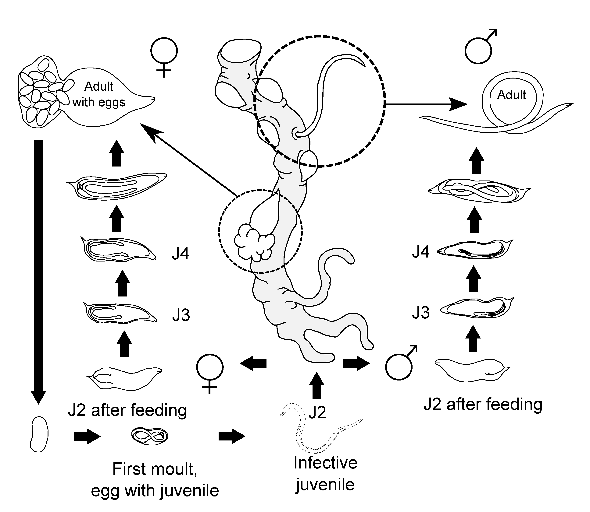
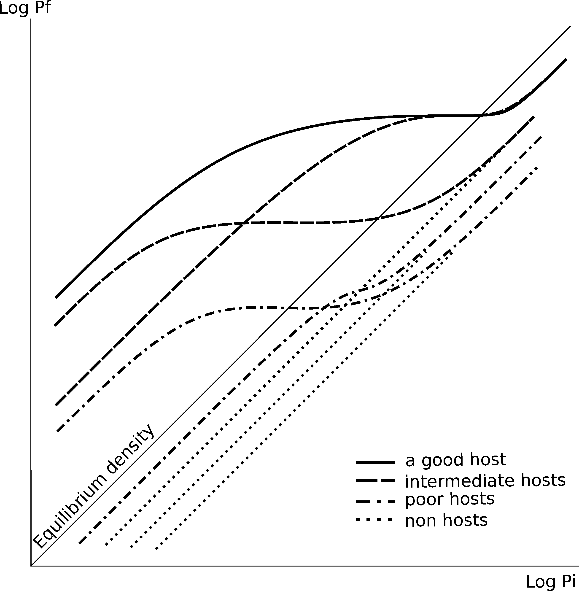
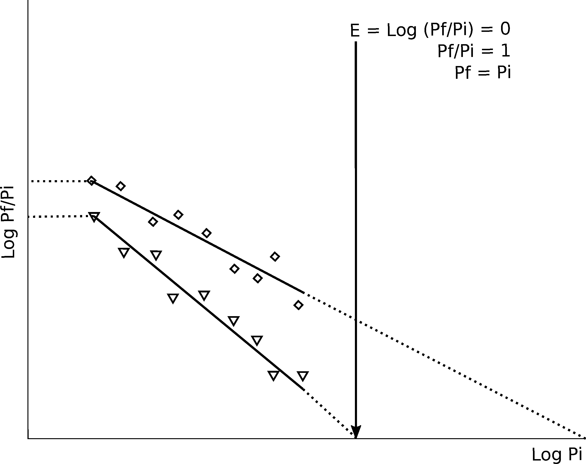

<style>
body {
text-align: justify}
</style>

-   [General introduction](#general-introduction)
    -   [*Meloidogyne* spp.](#meloidogyne-spp.)
        -   [Biology](#biology)
        -   [Economic importance](#economic-importance)
    -   [Population dynamics and yield
        losses](#population-dynamics-and-yield-losses)
    -   [Plant resistance](#plant-resistance)
    -   [Watermelon](#watermelon)
        -   [Importance](#importance)
        -   [Origin](#origin)
        -   [Cultivation challenges](#cultivation-challenges)
        -   [Grafting](#grafting)
    -   [Eggplant](#eggplant)
        -   [Importance](#importance-1)
        -   [Origin](#origin-1)
        -   [Cultivation challenges](#cultivation-challenges-1)
        -   [Grafting](#grafting-1)
    -   [Objectives](#objectives)
-   [Response of two *Citrullus amarus* accessions to isolates of three
    species of *Meloidogyne* and their graft compatibility with
    watermelon](#response-of-two-citrullus-amarus-accessions-to-isolates-of-three-species-of-meloidogyne-and-their-graft-compatibility-with-watermelon)
    -   [Introduction](#introduction)
    -   [Materials and methods](#materials-and-methods)
        -   [Nematode inoculum](#nematode-inoculum)
        -   [Response of *C. amarus* accessions to RKN
            isolates](#response-of-c.-amarus-accessions-to-rkn-isolates)
        -   [Experiment under plastic
            greenhouse](#experiment-under-plastic-greenhouse)
        -   [Grafting compatibility and fruit
            quality](#grafting-compatibility-and-fruit-quality)
        -   [Statistical analysis](#statistical-analysis)
    -   [Results](#results)
        -   [Pot experiments](#pot-experiments)
        -   [Experiment under plastic
            greenhouse](#experiment-under-plastic-greenhouse-1)
        -   [Grafting compatibility and fruit
            quality](#grafting-compatibility-and-fruit-quality-1)
    -   [Discussion](#discussion)
    -   [Conclusion](#conclusion)
    -   [Acknowledgments](#acknowledgments-1)
-   [Effect of *Citrullus amarus* accessions on the population dynamics
    of *Meloidogyne incognita* and **M. javanica** and watermelon
    yield](#effect-of-citrullus-amarus-accessions-on-the-population-dynamics-of-meloidogyne-incognita-and-m.-javanica-and-watermelon-yield)
    -   [Introduction](#introduction-1)
    -   [Materials and methods](#materials-and-methods-1)
        -   [Nematode inoculum](#nematode-inoculum-1)
        -   [Relationship between increasing *Pi* of *M. incognita* or
            *M. javanica* on ungrafted and grafted watermelon and *Pf*
            and plant
            biomass](#relationship-between-increasing-pi-of-m.-incognita-or-m.-javanica-on-ungrafted-and-grafted-watermelon-and-pf-and-plant-biomass)
        -   [Effect of *C. amarus* on *M. incognita* reproduction,
            disease severity and watermelon yield cultivated in plastic
            greenhouse](#effect-of-c.-amarus-on-m.-incognita-reproduction-disease-severity-and-watermelon-yield-cultivated-in-plastic-greenhouse)
        -   [Virulence selection](#virulence-selection)
        -   [Statistical analysis](#statistical-analysis-1)
    -   [Results](#results-1)
        -   [Relationship between increasing *Pi* of *M. incognita* or
            *M. javanica* on ungrafted and grafted watermelon and *Pf*
            and plant
            biomass](#relationship-between-increasing-pi-of-m.-incognita-or-m.-javanica-on-ungrafted-and-grafted-watermelon-and-pf-and-plant-biomass-1)
        -   [Effect of *C. amarus* on *M. incognita* reproduction,
            disease severity and watermelon yield cultivated in plastic
            greenhouse](#effect-of-c.-amarus-on-m.-incognita-reproduction-disease-severity-and-watermelon-yield-cultivated-in-plastic-greenhouse-1)
        -   [Virulence selection](#virulence-selection-1)
    -   [Discussion](#discussion-1)
    -   [Conclusion](#conclusion-1)
    -   [Acknowledgments](#acknowledgments-2)
-   [Host suitability of *Solanum torvum* cultivars to *Meloidogyne
    incognita* and *M. javanica* and population
    dynamics](#host-suitability-of-solanum-torvum-cultivars-to-meloidogyne-incognita-and-m.-javanica-and-population-dynamics)
    -   [Introduction](#introduction-2)
    -   [Materials and methods](#materials-and-methods-2)
        -   [Plant material](#plant-material)
        -   [Nematode inoculum](#nematode-inoculum-2)
        -   [Host suitability](#host-suitability)
        -   [Population dynamics of *M. javanica* on ungrafted and
            grafted eggplant
            ](#population-dynamics-of-m.-javanica-on-ungrafted-and-grafted-eggplant)
        -   [Effect of increasing *Pi* and seasonal cultivation on *M.
            incognita*](#effect-of-increasing-pi-and-seasonal-cultivation-on-m.-incognita)
        -   [Statistical analysis](#statistical-analysis-2)
    -   [Results](#results-2)
        -   [Host suitability](#host-suitability-1)
        -   [Population dynamics of *M. javanica* on ungrafted and
            grafted
            eggplant](#population-dynamics-of-m.-javanica-on-ungrafted-and-grafted-eggplant-1)
        -   [Effect of increasing *Pi* and seasonal cultivation on *M.
            incognita*](#effect-of-increasing-pi-and-seasonal-cultivation-on-m.-incognita-1)
    -   [Discussion](#discussion-2)
    -   [Acknowledgments](#acknowledgments-3)
-   [Fitness cost but no selection for virulence in *Meloidogyne
    incognita* after two consecutive crops of eggplant grafted onto
    *Solanum
    torvum*](#fitness-cost-but-no-selection-for-virulence-in-meloidogyne-incognita-after-two-consecutive-crops-of-eggplant-grafted-onto-solanum-torvum)
    -   [Introduction](#introduction-3)
    -   [Materials and methods](#materials-and-methods-3)
        -   [Effect of *S. torvum* on *M. incognita* reproduction,
            disease severity and eggplant yield cultivated in plastic
            greenhouse](#effect-of-s.-torvum-on-m.-incognita-reproduction-disease-severity-and-eggplant-yield-cultivated-in-plastic-greenhouse)
        -   [Selection for virulence and nematode
            fitness](#selection-for-virulence-and-nematode-fitness)
        -   [Statistical analysis](#statistical-analysis-3)
    -   [Results](#results-3)
        -   [Effect of *S. torvum* on *M. incognita* reproduction,
            disease severity and eggplant yield cultivated in plastic
            greenhouse](#effect-of-s.-torvum-on-m.-incognita-reproduction-disease-severity-and-eggplant-yield-cultivated-in-plastic-greenhouse-1)
        -   [Virulence selection](#virulence-selection-2)
    -   [Discussion](#discussion-3)
    -   [Acknowledgments](#acknowledgments-4)
-   [General discussion](#general-discussion)
-   [Conclusions](#conclusions)

Universitat Politècnica de Catalunya\
Departament d'Enginyeria Agroalimentària i Biotecnologia\
Programa de Doctorat Tecnologia Agroalimentària i Biotecnologia\

{width="30%"}

**Durability of resistance to *Meloidogyne* spp. mediated by *R*-genes
in solanaceous and cucurbitaceous crops**

PhD dissertation

**Helio Adán García Mendívil**

PhD Supervisor: **Dr. Francisco Javier Sorribas Royo**

Castelldefels, España

The work presented in this thesis has been developed in the Integrated
Plant-Parasitic Nematode Research Group of the Department of Agri-Food
Engineering and Biotechnology of the UPC (Universitat Politècnica de
Catalunya-BarcelonaTech, in the framework of the research projects:

"Efecto de la resistencia de genes *R* y la inducida por hongos
endofitos en la epidemiología de *Meloidogyne* y la producción y calidad
de la cosecha en solanaceas-cucurbitaceas\". Funded by Ministerio de
Economća y Competitividad (AGL2013-49040-C2-1R).

"Estrategias de gestión de germoplasma vegetal resistente a
*Meloidogyne* para evitar la selección de virulencia\". Funded by
Ministerio de Economća y Competitividad (AGL2017-89785-R).

And with help of the pre-doctoral grant provided by the Consejo Nacional
de Ciencía y Tecnología (No. 411638).


---------------

**Durability of resistance to *Meloidogyne* spp. mediated by *R*-genes
in solanaceous and cucurbitaceous crops**

Helio Adán García Mendívil\
**Abstract**

------------------------------------------------------------------------

Watermelon, *Citrullus lanatus* var. *lanatus*, and eggplant, *Solanum
melongena*, are two major crops commonly grafted in order to overcome
soilborne diseases. However, there are currently no commercially
available rootstocks resistant to root-knot nematodes (RKN),
*Meloidogyne* spp., infection in the *Cucurbitacea* family, and also a
narrow diversity in the *Solanaceae*, mostly in tomato and pepper. In
order find alternatives to address this problem, the main objective of
this thesis was to determine the durability of resistance to
*Meloidogyne* of *Citrullus amarus* and *Solanum torvum* as potential
rootstocks for watermelon and eggplant, respectively. In the first part
of this document, the work conducted with the cucurbits is presented in
chapters one and two, while chapters three and four correspond to work
done with solanaceous.

Durabilty of *Citrullus amarus* resistance to *Meloidogyne*: the
response of two *Citrullus amarus* accessions, BGV0005164 and
BGV0005167, was assessed against different *Meloidogyne arenaria*, *M.
incognita*, and *M. javanica* isolates in pot experiments and against
*M. incognita* in plastic greenhouse. (i) In the pot experiments, plants
were inoculated with a second-stage juvenile per cm^3^ of sterile sand
and maintained in a growth chamber at 25 C for 50 days. The watermelon
cv. Sugar Baby was included as a susceptible control for comparison. At
the end of the experiments, the number of egg masses and eggs per plant
was determined, and the reproduction index was calculated as the
percentage of the number of eggs produced in the *C. amarus* accessions
with regard to that produced in the susceptible cv. Sugar Baby. (ii) In
the plastic greenhouse experiment, the ungrafted watermelon cv. Sugar
Baby and watermelon grafted onto each of the *C. amarus* accessions and
onto the watermelon rootstock cv. Robusta were cultivated from May to
August 2016 in plots with nematode densities from 46 to 1392 J2 per 250
cm^3^ of soil at transplantation. At the end of the experiment, the
galling index and the number of eggs per plant were determined, and the
reproduction index was calculated. (iii) Additionally, the compatibility
of the two accessions with the watermelon cv. Sugar Baby and the effect
on fruit quality (weight, size, shape, firmness, pH, total soluble
solids, and flesh color) were assessed under a hydroponic system in a
greenhouse. The commercial rootstocks cv. Cobalt and cv. Robusta were
also included. Moreover (iv) The response of ungrafted and grafted
watermelon cv. Sugar baby onto the *C. amarus* accessions BGV0005164 and
BGV0005167 submitted to increasing densities of *M. incognita* and *M.
javanica* was studied in pot experiments to determine the maximum
multiplication rate, the maximum population density and the equilibrium
density of the root-knot nematode species and the effect on shoot dry
biomass of watermelon. (v) In plastic greenhouse conditions, the
ungrafted and grafted watermelon onto both *C. amarus* accessions, and
onto the *C. lanatus* rootstock cv. Robusta were cultivated for two
consecutive years in the same plots to assess the level of resistance to
*M. incognita* and crop yield. (vi) Additionally, after the second crop,
the putative selection for virulence in the nematode subpopulation
originated in the ungrafted and grafted watermelon was assessed in pot
experiments. The results showed that (i) all the *Meloidogyne* isolates
produced fewer egg masses and eggs per plant in the accessions than in
Sugar Baby. Both accessions performed as resistant against *M.
arenaria*, and from highly to moderately resistant to *M. incognita* and
*M. javanica* in pot experiments. (ii) In the plastic greenhouse
experiment, both *C. amarus* accessions performed as resistant to *M.
incognita*. (iii) Both *C. amarus* accessions were compatible with the
watermelon cv. Sugar Baby, but only the BGV0005167 accession did not
influence the fruit quality. (iv) The maximum multiplication rate, the
maximum population density and the equilibrium density values of both
*Meloidogyne* species were lower in grafted than ungrafted watermelon.
(v) In the plastic greenhouse experiment, the nematode densities in soil
at transplantation ranged from 1 to 53 J2 per 100 cm$^{3}$ of soil in
2017 and did not differ between grafted and ungrafted watermelons. At
the end of the crop, the galling index and the number of eggs per plant
was higher in ungrafted than in grafted watermelon both years. The *C.
amarus* accessions performed from highly resistant to resistant to *M.
incognita*, and the rootstock cv. Robusta from moderately resistant in
2017 to slightly resistant in 2018. All grafted watermelons yielded more
kg per plant than the ungrafted in both years. (vi) The repeated
cultivation of grafted watermelon onto *C. amarus* accessions did not
select for virulence. In conclusion, the BGV0005167 accession is a
promising rootstock for managing the three tropical root-knot nematode
species without influencing watermelon fruit quality. The results of
this study highlight the poorer host status of CI64 and CI67 accessions
to *M. incognita* and *M. javanica* compared to watermelon; the
stability of the *C. amarus* resistance; and the beneficial effect of
*C. amarus* on watermelon yield when cultivated in *Meloidogyne*
infested soils.

Durabilty of Solanum torvum resistance to Meloidogyne: several
experiments were carried out to assess the performance of commercial
*Solanum torvum* cultivars against *Meloidogyne incognita* and *M.
javanica* isolates from Spain. (i) The response of *S. torvum* rootstock
cultivars Brutus, Espina, Salutamu and Torpedo against *M. incognita*
and *Mi1.2* (a)virulent *M. javanica* isolates was determined in pot
experiments, and of cv. Brutus to an *N*-virulent isolate of *M.
incognita*, compared with that of the eggplant cv. Cristal. (ii) The
relationship between the initial and final population densities of *M.
javanica* on ungrafted and grafted 'Cristal' onto the *S. torvum*
'Brutus' was assessed, together with the effect on dry shoot biomass.
(iii) Finally, the population growth rate and the resistance level of
the four *S. torvum* cultivars against *M. incognita* was assessed under
plastic greenhouse conditions in two cropping seasons. (iv) The eggplant
*Solanum melongena* cv. Cristal, either ungrafted or grafted onto the
*S. torvum* rootstock cv. Brutus was cultivated for two consecutive
years in the same plots in a plastic greenhouse to assess the level of
resistance to *M. incognita* and crop yield. (v) At the end of the
second crop, the putative selection for virulence of the nematode
subpopulations coming from infected ungrafted and grafted eggplant was
assessed in the eggplant and in *S. torvum* in a pot experiment. The
results showed that: (i) all *S. torvum* rootstocks responded as
resistant to the *M. incognita* isolates and from highly resistant to
susceptible against *M. javanica* isolates. (ii) The maximum
multiplication rate of *M. javanica* on the ungrafted or grafted
eggplant were 270 and 49, respectively, and the equilibrium density were
1318 and 2056 eggs and J2 per 100 cm$^{3}$ soil, respectively. The
tolerance of the ungrafted eggplant was 10.9 J2 per 100 cm$^{3}$ soil,
and the minimum relative dry shoot biomass was 0.76. (iii) The
population growth rate of *M. incognita* on eggplant cv. Cristal
differed from that of the *S. torvum* cultivars in both cropping
seasons. (iv) Nematode population densities at transplantation in 2017
ranged from 2 to 378 J2 per 100 cm$^{3}$ of soil and did not differ
between ungrafted and grafted eggplant. At the end of each crop, higher
galling index and number of nematodes in soil and in roots were
registered in ungrafted than grafted eggplant. The grafted eggplant
performed as resistant in 2017 and as highly resistant in 2018. Eggplant
yield did not differ irrespective of grafting in 2017 after being
cultivated for 135 days, but it differed after 251 days of cultivation
in 2018. (v) In the pot experiment, *S. torvum* performed as resistant
to both *M. incognita* subpopulations. However, the *M. incognita*
subpopulation obtained from roots of *S. torvum* produced 49.4% less egg
masses and 56% less eggs per plant in the eggplant than the nematode
subpopulation obtained from roots of the eggplant cv. Cristal. These
results suggest that *S. torvum* is a valuable rootstock for managing
the two *Meloidogyne* species irrespective of the (a)virulence status,
and revealed that the infective and reproductive fitness of the nematode
decrease without having been selected for virulence.

General introduction {#general-introduction .unnumbered}
====================

{#fig:introduction width="100%"}

------------------------------------------------------------------------

Durability of resistance to *Meloidogyne* spp. mediated by *R*-genes in
solanaceous and cucurbitaceous crops\
**Helio A. García-Mendívil**\
PhD Dissertation\

------------------------------------------------------------------------

*Meloidogyne* spp. {#meloidogyne-spp. .unnumbered}
------------------


### Biology {#biology .unnumbered}

Root-knot nematodes (RKN), *Meloidogyne* spp., are the most damaging
plant parasitic nematodes worldwide. This genus comprises more than 100
species, however, most of the crop yield losses are caused by four of
them: the tropical species *M. arenaria*, *M. incognita* and *M.
javanica*, and the temperate species *M. hapla* [@Jones2013]. The
widened global warming can favor the expansion and proliferation of the
RKN tropical species in areas where the temperate RKN species
predominates. This fact evidence the importance of focusing research
efforts for designing management strategies to the tropical RKN species.

RKN are obligated parasites that require a suitable host plant for life
cycle completion (Fig.
[1](#fig:LifeCycle03){reference-type="ref"
reference="fig:LifeCycle03"}). The infective pre-parasitic vermiform
second-stage juveniles (J2) of *Meloidogyne* moves through the soil and
penetrate the root behind the tip, by using their protractible stylet
and releasing secretions containing cell-wall-degrading enzymes
[@Abad2003]. J2 then migrate intercellularly between the cortical
cells towards the root tip where they make a U-turn to later enter into
the vascular cylinder and moves until stablishing a feeding site. Each
J2 is able to induce the redifferentiation of five to seven
parenchymatic root cells into multinucleate and hypertrophied feeding
cells, the so-called giant cells, from which get the nutrients needed
for its life cycle completion [@Nyczepir2009a]. The accumulation of
these giant cells is responsible for the characteristic galled tissue
present in infected root systems, and for the disturbance of plant
development, defenses, and metabolism [@Shukla2018]. Once infection
occurs, juveniles become sedentary and assume a "sausage" shape as
increases its size. J2 then moults three times achieving the adult
stage. The tropical species, *M. arenaria, M. incognita* and *M.
javanica*, reproduce parthenogenetically. The sedentary pearl-shaped
adult female keeps feeding from the giant cells and is able to lay c.
300-500 eggs inside a gelatinous mass. Under unfavourable conditions
(high nematode density, scarcity of food or stressed plants) the
juveniles develop into males. Interestingly, some studies have found to
increase stimulation towards maleness by cropping several cucurbit
species [@Fassuliotis1970; @Walters2006; @ExpositoA.2019c].

```{r LifeCycle03, fig.cap="Diagram of the life cycle of the root-knot nematode, *Meloidogyne*. J2: second-stage juvenile; J3: third-stage juvenile; J4: fourth-stage juvenile (adapted from @moens2009meloidogyne).", echo=FALSE, out.width = "50%"}

```


*Meloidogyne* spp. is a poikilothermic organism, meaning that
temperature influence its life cycle and determine its length
[@Tyler1933]. The nematode development occurs between 10 and 32 C, and
needs to accumulate an amount of degree-days (K) at a certain basal
temperature (Tb) to complete its life cycle [@Trudgill1995]. For
instance, it has been reported that *Meloidogyne* spp. requires between
600 and 700 accumulated degree-days with a base temperature of 10 C to
complete its life cycle in tomato [@Ferris1985]. However, the thermal
time requirements for life cycle completion can differ between RKN
populations of a given species depending of its geographic origin,
showing its ability to adapt to environmental factors, i.e., optimal
temperatures of 25-30C and 32-34C were found in populations of *M.
javanica* from Australia and California, respectively [@Ferris1979].
Such adaptive ability may be one of the main reasons of its success in
spreading globally, and also evidence its importance for modern
agriculture.

### Economic importance {#economic-importance .unnumbered}

The occurrence of soilborne diseases and pests have increased in recent
years as consequence of the intensive cultivation needed to supply a
growing population in limited land resources [@Thies2015c]. A
comprehensive summary of the estimation of yield losses caused by RKN in
several crops have been published by Greco and Di Vito [-@Greco2009a].
The cucurbit and solanaceous crops are two of the crop families most
frequently cultivated worldwide that are severely affected by RKN.
Regarding cucurbit crops, maximum yield losses of 88, 53 and 35% in
cucumber, zucchini and watermelon, respectively, have been estimated
under greenhouse conditions [@Gine2014a; @Vela2014;
@Lopez-Gomez2014a, 2015]. RKN are also one of the most
damaging soilborne pathogens for solanaceous crops, specially under
protected cultivation, with maximum yield losses of 94, 95 and 100%
reported for pepper, eggplant and tomato, respectively [@Gine2017c;
@Hallmann2018a].

Population dynamics and yield losses {#population-dynamics-and-yield-losses .unnumbered}
------------------------------------

Population dynamics studies the factors that determine the temporal
oscillation of densities of individuals from the same specie living in a
certain area. The nematode population density at sowing or transplanting
of a crop is related with its productivity. The proper modeling of
population dynamics allows to estimate the densities variability over
time in relation with influencing factors, and therefore, to relate them
with the yield losses that nematodes could cause. Modeling the damage
levels enable to calculate parameters such the tolerance limit (*T*),
the maximum population density above which yield losses start to occur,
and the maximum yield losses (*m*). These parameters, along with the
maximum reproduction rate (*a*)(*Pf/Pi* at low densities
[@Ferris1985], and the equilibrium density, that initial population at
which nematode receive just enough supply of nutrients to maintain the
population density at the same level from begin at the end of the
growing season; permits to evaluate the importance of a determined
nematode from a growing area, or the effect of management strategies.
These quantitative studies constitute the basis for populations'
evolution understanding of specific patosystems with typical
agro-environmental conditions from determine growing area, and to design
and implement effective and durable management strategies (Sorriba and
Verdejo-Lucas 2011; Fig
[2](#fig:FigPivsPf){reference-type="ref"
reference="fig:FigPivsPf"}).


```{r FigPivsPf, fig.cap="Relation between initial and final densities in experiments with a nematode on a good host, intermediate hosts, poor hosts, and a nonhost. *Pi* and *Pf*: initial and final densities on logarithmic scales. Equilibrium density: *Pf = Pi* (adapted from @Seinhorst1970a).", echo=FALSE, out.width = "50%"}

```

Population density fluctuations are affected by denso-independent and
denso-dependent factors. Denso-independent factors, such climate,
environmental conditions, and intraspecific competition, influence from
outside of population, while denso-dependent include interspecific
competition and the action of antagonist or predators. Two phases can be
distinguish: one during the host plant cultivation in which nematode
have enough nutrients to increase its population density, and the second
during either no cropping periods in which there is no food supply and
population density do not increase, or decrease depending on the
nematode and the duration of periods with no host cultivation.

The multiplication growth rate (*Pf*/*Pi*), that is, the relationship
between the nematode population density at transplanting (*Pi*) and at
the end of the crop (*Pf*) is consider a good indicator of population
growth. In absence of competition between individuals for limiting
resources, the *Pf*/*Pi* maximize (*a*), and the relationship with *Pi*
its a straight line (*Pf* = *aPi*; thus *Pf*/*Pi* = *a*). However,
increases in *Pi* induce competition between individuals for healthy
plant tissue, can induce alteration in sex differentiation or to reduce
in female fecundity, thus *Pf*/*Pi* decreases. In the case of nematodes
that reproduce parthenogenetically, such *Meloidogyne* spp., the
relationship between *Pf*/*Pi* and *Pi* follows an inverse potential
function (*Pf*/*Pi* = *aPi*^-b^, where *a* is the maximum multiplication
rate, and *-b* is the decrease rate of the population as *Pi* increase).
The maximum multiplication rate (*a*) is a good indicator of the plant
host status to Meloidogyne. Higher values of *a* indicate that the plant
is a good host and low values, a pooor host [@Ferris1985].

The population growth rate can also be useful to estimate the *Pi* at
which *Pf*/*Pi* = 1, the equilibrium density (*E*). This can be
calculated from the regression equation obtained from linearizing the
relationship between the *Pi* and the multiplication rate (*Pf/Pi*). The
population growth rate is also a useful indicator that allows to compare
between plant species and/or germplasms, as well as the effectiveness of
control methods [@Talavera2009b; @Gine2017b; @Exposito2018c]; Fig
[3](#fig:LogPivsLogPfPi3){reference-type="ref"
reference="fig:LogPivsLogPfPi3"}).


```{r LogPivsLogPfPi3, fig.cap="Relation between initial population density (*Pi*) and multiplication rate (*Pf/Pi*) of RKN on two hypothetical germplasms (adapted from @Ferris1985).", echo=FALSE, out.width = "50%"}

```


Regarding to crop yield losses, there are two parameters that can be
calculated by estimating the relationship between increasing levels of
*Pi* and the relative crop biomass or yield according to the Seinhort's
damage model [@fdi:010017629]: 

$$
\begin{aligned}
&y = m + (1 - m) 0.95 ^{\frac{Pi}{T-1}} &	for Pi &> T \\
&y = 1						            &	for Pi &\leq T \\
&y = m								    &	for Pi &\longrightarrow \infty\end{aligned}
$$

The nematode population density above which yield loss start to occur is
defined as the nematode damage threshold level or the tolerance limit of
the crop (*T*). This value, along with the the minimum relative yield
(*m*) are important parameters to characterize the response of a crop
plant to a nematode population. The parameter *T* manifests itself at
small nematode densities and *m* at larger ones [@Greco2009a]; Fig
[\[fig:Figure107\]](#fig:Figure107){reference-type="ref"
reference="fig:Figure107"}).

width=0.9 

[\[fig:Figure107\]]{#fig:Figure107 label="fig:Figure107"}

Plant resistance {#plant-resistance .unnumbered}
----------------

The most commonly used strategy for RKN management has been, until
recent years, the use of fumigant and non fumigant nematicides
[@Nyczepir2009a]. However, regulations such the European directive
2009/128/EC and the U.S. Clean Air Act [@U.S.2012]), have brought
special attention on the research and development of environmentally
friendlier management strategies. A promising alternative strategy
involves the use of resistant plants, those whose have the ability to
suppress infection development, and/or reproduction of plant-parasitic
nematodes [@Roberts2009]. Plant resistance has proven to be effective
and economically profitable [@Sorribas2005a]), and also reduce yield
losses of the follwing crop [@OrnatC1997a]; [@Talavera2009b];
[@Westphal2011]; [@Thies2015]; [@Gine2017b]; [@ExpositoA.2019c].

The resistance levels of a determined plant germplasm can be categorized
in relation to a susceptible standard [@Hadisoeganda1982c]. Expressed
as the percentage of RKN reproduction compared to that in a susceptible
standard, this parameter is called the reproduction index (RI; Fig
[\[fig:Figure104\]](#fig:Figure104){reference-type="ref"
reference="fig:Figure104"}).

width=0.9 

[\[fig:Figure104\]]{#fig:Figure104 label="fig:Figure104"}

Despite its advantages, the expression of plant resistance can be
affected by several factors, such the genetic background of the plant
cultivar and/or the nematode species or population [@Cortada2008]. The
selection of virulent nematode populations due to repeated cultivation
of the same resistance gene [@Verdejo-Lucas2009a]; [@Gine2017b];
[@ExpositoA.2019c]. Moreover, there are only a few resistance genes
introgressed into commercial solanaceous cultivars at present, and none
in cucurbits. That are, the *Me1, Me3* and *N* gene in pepper, and the
*Mi1.2* gene in tomato. Soil temeprature can also affect the expression
of plant resistance. It is known that the *Mi1.2* gene is affected at
soil temperatures above 30 C, while the resistance of the *N* gene is
reported to be partially lost at 32 C [@araujo1982effects];
[@Thies1998]. Thus,plant resistance is a valuable management tool but
it should be used in a proper manner to maximize its effectiveness.
Moreover, more research are needed to identify new resistance sources
for increasing the *R*-genes that could be used in rotation schemes .

Grafting vegetables onto resistant rootstocks is an effective method to
control soilborne pathogens when no commercial cultivars are available
[@Miguel2004a]; [@Cohen2007]; [@Thies2016]; [@Kumar2018]. This control
method was essentially rediscovered in the past two decades and quickly
expanded to become a common practice at the present [@Thies2015c];
[@Kyriacou2017]. Grafting has expanded mainly in the Cucurbitaceae and
the Solanaceae families [@Moncada2013]. The use of anatomical and
physiological compatible graft combinations improve the plant
performance under biotic or abiotic stress conditions when compared with
that of the ungrafted scion, allowing rapid response to new pathogen
races without the prolonged screening and selection required for
breeding resistance into cultivars [@Davis2008]. Although the
tolerance and resistance to abiotic and biotic stresses, respectively,
along with an increasing productivity have been the main drivers of
rootstock selection and breeding, the effect of grafting on fruit
quality is also another important factor to take into account
[@Kyriacou2017].

Some strategies proposed to avoid the selection for RKN virulence or to
reduce the level of virulence and crop yield losses consider to include
resistant and susceptible crops in rotation sequences
[@Talavera2009b]), the use of crops of two different resistant plant
species [@ExpositoA.2019c]), or to pyramid different *R*-genes
[@Djian2014]. However, as literature reviewed points out, most of the
research done have been focusing on tomato and pepper. Thus, the aim of
this thesis was to increase the diversity of resistance sources against
RKN by potentially effective rootstocks for two species of the most
economically important botanical families cultivated, the cucurbitaseous
watermelon (*Citrullus lanatus* var. *lanatus*), and the solanaseous
eggplant (*Solanum melongena*). A brief description of these two crops
and their potential rootstocks is presented in the next two sections.

width=


. [\[fig:Figure108\]]{#fig:Figure108 label="fig:Figure108"}

2

Watermelon {#watermelon .unnumbered}
----------

### Importance {#importance .unnumbered}

Watermelon is the most cultivated cucurbit crop worldwide. The global
production in 2017 was ca. 118 million t in ca. 3.4 million ha, 38% of
the arable land destined to cultivate for this botanical family, with an
estimated value of 48.9B [@FAOSTAT2017c]; Fig
[\[fig:Figure108\]](#fig:Figure108){reference-type="ref"
reference="fig:Figure108"}). In spite of its origin theorized in the
African continent, most of the watermelon are produced in Asia, with 67%
of total world production in China. Within the European Union (EU),
Spain was the main watermelon producer during 2017, with 20,026 ha
harvested to produce 1.1 million t of fruit marketed with an estimated
value of 331M, 68% of which were exported [@MAPA2019]. The watermelon
fruit composition is 93% water, with small amounts of protein, fat,
minerals, and vitamins. The major nutritional fruit components are
carbohydrates (6.4 g/100 g), vitamin A (590 IU), and lycopene (4,100
$\mu$g/100g, range 2300--7200), an anticarcinogenic compound found in
red flesh watermelon, even in higher amounts than in tomato, pink
grapefruit, or guava [@Wehner2008].

### Origin {#origin .unnumbered}

Watermelon is a diploid creeping monoecious crop that belongs to the
*Cucurbitaceae* family. The taxonomy of the genus *Citrullus* have had
major misapplication of names until recent years, including that of
watermelon, *C. lanatus*, itself [@Chomicki2015]; [@Renner2014]. The
Southern African region is reported to be the center of diversity and
probably the center of origin of most of the *Citrullus* species
[@Dane2004]; [@Rubatsky2001]; [@Robinson1997]. However, four
hypotheses have been proposed for the origin of watermelon: i) that it
descends from the northern African colocynth (*C. colocynthis*,
[@Singh1978]; [@Sain2002]; [@McCreight2013]. ii) That it derives from
the South African citron melon, *C. amarus*, previously referred as *C.
lanatus* var. *citroides* [@Robinson1997]; [@Maynard2000];
[@Rubatsky2001]; [@Chomicki2015]. iii) That it stems from the West
African *C. mucosospermus* [@Guo2013]; [@Chomicki2015]), and iv) Recent
research with polygenomic analyses of nuclear gene sequences suggest
that the white-fleshed Sudanese Kordophan melon (*Citrullus vulgaris*)
is the closest relative of domesticated watermelon that was originated
and domesticated in north-eastern Africa [@Renner2019]; Fig
[\[fig:Figure108\]](#fig:Figure108){reference-type="ref"
reference="fig:Figure108"}).

### Cultivation challenges {#cultivation-challenges .unnumbered}

The modern cultivated watermelon has a narrow genetic base
[@Szamosi2009]; [@Solmaz2010]; [@Nimmakayala2014]) attributed to many
years of domestication and selection of its desirable horticultural
traits such as red-scarlet flesh color and sweetness [@Levi2001b];
[@Hwang2011]; [@Lambel2014]; [@Nimmakayala2014]. The continued use of
cultivars with narrow genetic base for breeding resulted in reduced gene
diversity among American watermelon accessions [@Wang2015];
[@Zhang2016]. This has derived in susceptibility of crops to random and
emerging biotic and abiotic stresses [@Levi2001a]; [@Mo2016]. In spite
of being consider a less suitable host for RKN than other cucurbit
crops, watermelon maximum yield losses of 37% have been recently
reported in Spain [@Lopez-Gomez2014a]. Moreover, as the next section
will better describe, modern watermelons are commonly grafted onto
commercial rootstocks owing its resistance to fusarium, however, these
rootstocks are not resistant to *Meloidogyne*
[@Kokalis-Burelle2011; @Lopez-Gomez2016; @Gine2017c].

### Grafting {#grafting .unnumbered}

A detailed history of cucurbit grafting have been done by Davis
([-@Davis2008]. The primary motive for grafting cucurbits is to avoid
damage caused by soilborne pests and pathogens when genetic or chemical
approaches for disease management are not available [@Oda2002].
Research on cucurbit grafting began in the 1920s with the use of
*Cucurbita moschata* as a rootstock for watermelon, but then bottle
gourd (*Lagenaria siceraria*) soon became the preferred rootstock. By
the year 1998, approximately 95% of watermelon and oriental melons were
grafted onto squash or bottlegourd rootstocks in Japan, Korea, and
Taiwan [@Oda2003]. Possibly because of the widespread use of bottle
gourd rootstocks, there are reports of plants affected by Fusarium wilt,
probably the most common and damaging soilborne disease of cucurbit
crops worldwide, caused by *Fusarium oxysporum* Schltdl. Moreover both
rootstocks are susceptible to *Meloidogyne* infection
[@Kokalis-Burelle2011]; [@Lopez-Gomez2016]; [@Gine2017c]. Hence, an
alternative genetic source of resistance to both pathogens must be found
and properly characterized in order to be able to design an effective
and widely applicable RKN management strategy.

A potential alternative rootstock for watermelon, is its close relative
citron or preserving melon, *C. amarus*. The flesh of the citron is
white or green, and may vary from bland to bitter tasting. Its rind is
used to make pickles, and the fruit are feeding to livestock
[@Wehner2008]. Conversely to watermelon, citron melon exhibits wider
genetic variation [@Levi2001b]) suggesting its genetic worthiness as a
source of valuable genes for breeding [@Ngwepe2019]. This rootstock
have show to be resistant to several soil pathogens such as fusarium
wilt, gummy stem blight, powdery mildew, potyviruses, and some species
and populations of *Meloidogyne* [@Gusmini2005]; [@Huitron2007a];
[@Guner2008]; [@Tetteh2010]; [@Thies2016]. In spite of it, there is
little information about it use to control RKN in the EU, thus, research
on its response to local population must be done before include it in a
management strategy.

Eggplant {#eggplant .unnumbered}
--------

### Importance {#importance-1 .unnumbered}

Eggplant, *Solanum melongena*, is the third most widely cultivated
Solanaceous fruiting crop after potato and tomato. The global production
in 2017 was ca. 52 million t in ca. 1.8 million ha, 7% of the arable
land destined to cultivate for this family, with an estimated value of
36.2B. Most of eggplants production is made in China and India, with ca.
87% of global production done there in 2017. Italy, Spain and Romania
were the top three eggplant producer countries in the EU, with 286,473,
225,912 and 124,429 t produced, respectively [@FAOSTAT2017c]; Fig
[\[fig:Figure111\]](#fig:Figure111){reference-type="ref"
reference="fig:Figure111"}). Eggplant is not high in the majority of
health-related micronutrients, but it is very low in fat an calorie and
a rich source of nutritionally and pharmaceutically useful compounds,
such a number phytonutrients, especially hydroxycinnamic acid (HCA)
conjugates, potentially involved in consumer health, fruit taste and
texture [@Meyer2015]; [@Chapman2019].

### Origin {#origin-1 .unnumbered}

The Asian eggplant is a widely grown species from the *Solanaceae*
family. Eggplant is especially popular in the Southeast Asia and the
Mediterranean region . Several non-exclusive theories have been proposed
regarding eggplant's origin. The general consensus [@Weese2010];
[@Knapp2013]) is that the African/Middle Eastern species *S. incanum*
was transported into Indo-China where the true wild progenitor, *S.
insanum*, evolved, from which *S. melongena* is derived
[@Chapman2019].

### Cultivation challenges {#cultivation-challenges-1 .unnumbered}

The commercial eggplant cultivars also have a narrow genetic diversity
that, is even poorer than for other solanaceous crops such as tomato and
pepper. A list of eggplant diseases and pests, and resistances described
has been well summarized by Daunay ([-@Daunay2008]. Among the most
common soil borne diseases affecting eggplants are bacterial, fusarium
and verticillium wilt, caused by *Ralstonia solanacearum*, *Fusarium
oxysporum* f. sp. *melongenae*, *Verticillium dahliae* and *V.
albo-atrum*. Moreover, it is also susceptible to RKN.

### Grafting {#grafting-1 .unnumbered}

Eggplant grafting is mostly used in intensive production conditions. As
Daunay ([-@Daunay2008]) well summarize, there are currently three types
of eggplant rootstock: i) *S. melongena* lines and hybrids that resist
to Fusarium and bacterial wilt, and Phomopsis blight, ii) rootstocks
based on the use of *S. integrifolium*, which also resists to Fusarium
and bacterial wilts, and is used directly as a rootstock or as parent
crossed with *S. melongena* varieties for producing interspecific hybrid
rootstocks (*S. integrifolium $\times$ S. melongena*), and iii) the
third type of rootstocks is composed by *Solanum* species such *S.
torvum* and *S. sanitswongsei*. However, within Europe eggplant is
grafted mostly onto tomato or tomato interspecific hybrids (*L.
esculentum $\times$ L. hirsutum*).

*Solanum torvum* is a wild relative of eggplant that is resistant to *V.
dahliae*, *R. solanacearum*, *F. oxysporum* f. sp. *Melongenae*, and
some RKN populations [@Singh1997]; [@Bletsos2003]; [@Daunay2008];
[@Gisbert2011]. Although resistance of *S. torvum* rootstocks to *M.
incognita* have been consistently described against several populations
from France [@Daunay1985]), India [@Shetty1985]; [@Dhivya2014b]),
Japan [@Hara1983]; [@Ali1992]), Pakistan [@Rahman2002a]) and Turkey
[@Curuk2009]); several studies found discrepancies on the levels of
resistance to *M. arenaria* [@Daunay1985]; Gonzalez et al; 2010; Ryu et
al., 2011; [@Uehara2017b]; [@Ocal2018a]) and *M. javanica*
[@Daunay1985]; [@Boiteux1996]; [@Tzortzakakis2006a]; [@Ocal2018a]. As
far as literature reviewed pointed out, there are no enough studies that
widely characterize the response of *S. torvum* against *Meloidogyne*
populations occurring in Spain.

Most of grafting application have expanded mainly in the *Cucurbitaceae*
and *Solanaceae* family, both major vegetable crops that are commonly
rotated to maximize land use and boost productivity
[@Lopez-Gomez2015a]; [@Kyriacou2017]. The proper screening of *C.
amarus* and *S. torvum* rootstocks could give crucial information about
potential tools already available to design effective and
environmentally friendlier strategies to managing RKN. In particular,
this work will focus on *Meloidogyne* populations ocurrying in Spain,
some of them previously described as virulents to the Mi1.2 gene in
tomato [@Ornat2007]; [@Verdejo-Lucas2012].

width=


[\[fig:Figure111\]]{#fig:Figure111 label="fig:Figure111"}

2

Objectives {#objectives .unnumbered}
----------

The main objective of this thesis was to determine the durability of
resistance to *Meloidogyne* of *Citrullus amarus* and *Solanum torvum*
as potential rootstocks for watermelon and eggplant, respectively. This
objective was divided into specific objectives to determine:

1.  The response of two *Citrullus amarus* accessions, BGV0005164 and
    BGV0005167, against different *Meloidogyne arenaria*, *M.
    incognita*, and *M. javanica* (a)virulent isolates in pot
    experiments and against *M. incognita* in plastic greenhouse
    (Chapter 1).

2.  The performance of ungrafted and grafted watermelon onto *C. amarus*
    accessions submitted to increasing densities of *M. incognita* and
    *M. javanica* in pot experiments to determine the maximum
    multiplication rate, the maximum population density and the
    equilibrium density of the root-knot nematode species and the effect
    on shoot dry biomass of watermelon (Chapter 2).

3.  The durability of resistance of *C. amarus* accessions after two
    consecutive years in the same plots, the selection for virulence and
    the fitness cost for the nematode (Chapter 2).

4.  The response of commercial *Solanum torvum* cultivars against
    (a)virulent isolates of *M. incognita* and *M. javanica* in pot
    experiments and against *M. incognita* in plastic greenhouse in two
    cropping seasons (Chapter 3).

5.  The performance of ungrafted and grafted eggplant onto *S. torvum*
    'Brutus' submitted to increasing densities of *M. javanica* in pot
    experiments to determine the maximum multiplication rate, the
    maximum population density and the equilibrium density of the
    root-knot nematode species and the effect on shoot dry biomass of
    watermelon (Chapter 3).

6.  The durability of resistance of *S. torvum* 'Brutus' after two
    consecutive years in the same plots, the selection for virulence and
    the fitness cost for the nematode (Chapter 4).

Response of two *Citrullus amarus* accessions to isolates of three species of *Meloidogyne* and their graft compatibility with watermelon
=========================================================================================================================================

{#fig:Waterfield width="100%"}

**Response of two *Citrullus amarus* accessions to isolates of three
species of *Meloidogyne* and their graft compatibility with watermelon**

**Helio A. García-Mendívil, María Munera, Ariadna Giné, Nuria Escudero,
María Belén Picó, Carmina Gisbert and Francisco J. Sorribas.** . *Crop
Protection*, 119, 208--213. https://doi.org/10.1016/j.cropro.2019.02.005

**Abstract**

------------------------------------------------------------------------

The response of two *Citrullus amarus* accessions, BGV0005164 and
BGV0005167, was assessed against different *Meloidogyne arenaria*,
*Meloidogyne incognita*, and *Meloidogyne javanica* isolates in pot
experiments and against *M. incognita* in plastic greenhouse. In the pot
experiments, plants were inoculated with a second-stage juvenile per
cm^3^ of sterile sand and maintained in a growth chamber at 25 C for 50
days. The watermelon cv. Sugar Baby was included as a susceptible
control for comparison. At the end of the experiments, the number of egg
masses and eggs per plant was determined, and the reproduction index was
calculated as the percentage of the number of eggs produced in the *C.
amarus* accessions with regard to that produced in the susceptible cv.
Sugar Baby. In the plastic greenhouse experiment, the ungrafted
watermelon cv. Sugar Baby and watermelons grafted onto each of the *C.
amarus* accessions and onto the watermelon rootstock cv. Robusta were
cultivated from May to August 2016 in plots with nematode densities from
46 to 1392 J2 per 250 cm^3^ of soil at transplantation. At the end of
the experiment, the galling index and the number of eggs per plant were
determined, and the reproduction index was calculated. Additionally, the
compatibility of the two accessions with the watermelon cv. Sugar Baby
and the effect on fruit quality (weight, size, shape, firmness, pH,
total soluble solids, and flesh color) were assessed under a hydroponic
system in a greenhouse. The commercial rootstocks cv. Cobalt and cv.
Robusta were also included. All the *Meloidogyne* isolates produced less
egg masses and eggs per plant on the accessions than on Sugar Baby. Both
accessions performed as resistant against *M. arenaria*, and from highly
to moderately resistant to *M. incognita* and *M. javanica* in pot
experiments. In the plastic greenhouse experiment, both *C. amarus*
accessions performed as resistant to *M. incognita*. Both *C. amarus*
accessions were compatible with the watermelon cv. Sugar Baby, but only
the BGV0005167 accession did not influence the fruit quality. Then, the
BGV0005167 accession is a promising rootstock for managing the three
tropical root-knot nematode species without influencing watermelon fruit
quality.

------------------------------------------------------------------------

2

Introduction
------------

Watermelon is one of the major cultivated cucurbit crops, with an
estimated worldwide production of ca. 117 million t from 3.5 million ha
[@FAOSTAT2017c]. As a result of the intensive cultivation in limited
land resources, soilborne diseases and pests have significantly
increased in recent years [@Thies2015c]. The root-knot nematode (RKN)
*Meloidogyne* spp. is currently one of the main pathogens in cucurbit
crops. Maximum yield losses of 88% in cucumber, 53% in zucchini, and 35%
in watermelon cultivated under plastic greenhouses have been estimated
in Spain [@Gine2014a]; [@Vela2014]; [@Lopez-Gomez2014a],
[-@Lopez-Gomez2015a]. The control of RKN has widely been done using
fumigant and non fumigant nematicides [@Nyczepir2009a]. Nonetheless,
the interest in nonchemical control alternatives has increased according
to recent regulations such as the European Directive 2009/128/EC and the
U.S. Clean Air Act [@U.S.2012]. In this scenario, plant resistance is
a key tool for RKN management because it is an effective and
economically profitable control method [@Sorribas2005a]. Cropping
resistant cultivars reduces the growth rate and the equilibrium density
of the RKN population, as well as crop yield losses [@Talavera2009b].
Moreover, it reduces crop yield losses of the following crop in the
rotation scheme [@OrnatC1997a]; [@Thies2004]; [@Westphal2011].
Grafting onto resistant rootstocks is an alternative method to control
soilborne pathogens when no commercial resistant cultivars are available
[@Yetsr2003]; [@Miguel2004a]; [@Cohen2007]; [@Oda2002]; [@Thies2016].
Regarding watermelon, it has been commonly grafted onto commercial
rootstocks such as *Cucurbita maxima* $\times$ *Cucurbita moschata* and
*Lagenaria siceraria* owing to their resistance to fusarium wilt.
However, both rootstocks are susceptible to infection by *Meloidogyne*
[@Davis2008]; [@Hassell2008]; [@Thies2010], [-@Thies2015]a;
[@Kokalis-Burelle2011]; [@Lopez-Gomez2016]; [@Gine2017c]. In the last
few years, some accessions of citron melon, *Citrullus lanatus* var.
*citroides*, most recently referred as *Citrullus amarus*
[@Chomicki2015]), have been proven to be useful as watermelon
rootstock. Indeed, these accessions provide resistance to fusarium wilt
[@Huitron2007a]; [@Levi2017a]) and some RKN species in both greenhouse
[@Thies2003], [-@Thies2007]) and open field cultivation
[@Huitron2007a]; [@Thies2010], [-@Thies2015]a, [-@Thies2016]. In
addition, watermelon grafted onto *C. amarus* yielded more than those
grafted onto *L. siceraria*, *C. maxima* $\times$ *C. moschata* or
*Praecitrullus fistulosus*, without affecting the quality and the size
of the fruits [@Kyriacou2016]; [@Thies2015]a; [@Fredes2017a]. However,
not all *C. amarus* accessions responded equally to RKN isolates
[@Thies2003], [-@Thies2007]; [@Thies2016]; [@Levi2017a]), the screening
of new accessions against local RKN populations being necessary to
assure their efficacy. Furthermore, the compatibility with the scion and
the effect on the quality of fruits is also required to be considered as
a potential rootstock. The aim of this study was to characterize the
response of two experimental *C. amarus* accessions against several
isolates of *Meloidogyne arenaria*, *Meloidogyne incognita* and
*Meloidogyne javanica* under controlled conditions and against *M.
incognita* under plastic greenhouse conditions. Additionally, the
compatibility of the two *C. amarus* accessions with the watermelon cv.
Sugar Baby and the effect on fruit quality were assessed in a hydroponic
system under greenhouse.

Materials and methods
---------------------

### Nematode inoculum

Seven isolates of *M. arenaria*, *M. incognita* and *M. javanica* were
used in the experiments (Table [1.1](#tab:table201){reference-type="ref"
reference="tab:table201"}). All the RKN isolates were maintained on the
susceptible tomato cv. Durinta (Seminis Seeds, St. Louis, Missouri).
Second-stage juveniles (J2) were used as the inoculum. The J2 were
obtained from eggs by maceration of the infected roots in a 5%
commercial bleach solution (40 g/L NaOCl) for 10 min according to the
Hussey and Barker ([-@HusseyR.S.Barker1973c]) method. After maceration,
the egg suspension was filtered through a 74 $\mu$m sieve, and then, the
eggs were collected on a 25 $\mu$m sieve and placed on Baermann trays
[@Whitehead1965a]. The J2 emerged during the first 24 h were
discarded. After that, the J2 emerged were recovered every two days and
maintained at 9 C until the pot experiments were carried out. The
identification of the *Meloidogyne* species was confirmed using SCAR-PCR
markers [@Zijlstra2000].

::: {#tab:table201}
  *Meloidogyne* spp.   Isolate     Geographic origin   (a)virulence   Reference
  -------------------- ----------- ------------------- -------------- ------------------
  *M. arenaria*        MA68        Barcelona           Avirulent      [@Exposito2018c]
  *M. incognita*       Agropolis   Barcelona           Avirulent      [@Gine2017c]
                       Garriga     Barcelona           Avirulent      [@Exposito2018c]
  *M. javanica*        MJ05        Barcelona           Avirulent      [@Ornat2007]
                       Tugues      Barcelona           Avirulent      [@Exposito2018c]
                       Bay         Murcia              Avirulent      [@Exposito2018c]
                       MJLg        Almería             Virulent       [@Exposito2018c]

  : *Meloidogyne* species and isolates used in pot experiments,
  geographic origin, and (a)virulence status against the *Mi1.2* gene of
  tomato.
:::

2

### Response of *C. amarus* accessions to RKN isolates

The *C. amarus* accessions BGV0005164 (CI64) and BGV0005167 (CI67),
obtained from Institute for the Conservation and Breeding of
Agricultural Biodiversity (COMAV-UPV) gene bank collection (Valencia,
Spain), were assessed against the *Meloidogyne* isolates in three
different pot experiments. In the first experiment, the accessions CI64
and CI67 were assessed against the *Mi1.2* avirulent isolates Agropolis
(*M. incognita*) and MJ05 (*M. javanica*). In the second experiment, the
response of the two *C. amarus* accessions was assessed against the
*Mi1.2* avirulent isolates MA68 of *M. arenaria*; Agropolis and Garriga
of *M. incognita*; and Bay, MJ05, and Tugues of *M. javanica*. In the
third experiment, the response of both *C. amarus* accessions was
assessed against the *Mi1.2* virulent isolate MJLg of *M. javanica*. The
watermelon cv. Sugar Baby (SB) (Intersemillas S. A., Loriguilla,
Valencia, Spain) was included as susceptible control for comparison in
all experiments. The watermelon rootstock cv. Robusta (RO) (*C.
lanatus*, Intersemillas S. A., Loriguilla, Valencia, Spain) was also
included for comparison as resistant control [@Lopez-Gomez2016]) in the
third experiment. Experiment 1 and 3 were carried out once, and each
plant-RKN isolate combination was replicated 10 times. Experiment 2 was
repeated once, and each plant-RKN isolate combination was replicated
seven and eight times in the first and second experiment repetition,
respectively.

##### 

All experiments were carried out following the same procedure. Briefly,
seeds were germinated according to the method given in Exposito et al.
([-@Exposito2018c]. Seedlings were transplanted to 200 cm$^{3}$ pots
containing sterile sand and maintained in a growth chamber at 25 $\pm$
2C with a 16:8 h (light:dark) photoperiod for a week and then inoculated
with 1 J2 per cm$^{3}$ soil. Plants were maintained in the growth
chamber for 50 days. Plants were watered as needed throughout the
experiment and fertilized with a slow-release fertilizer (15% N, 9%
P$_{2}$O$_{5}$, 12% K$_{2}$O, 2% MgO$_{2}$, microelements; Osmocote
Plus). Soil temperatures were recorded daily at 30 min intervals with a
PT100 probe (Campbell Scientific Ltd.) placed into the pots at 4 cm
depth.

At the end of the experiments, the roots were carefully washed and
weighed. Then, in the first and second experiments, the roots were
submerged in 15 mg/L erioglaucine solution (Acros Organics) for 20 min
to stain the egg masses before counting them [@Omwega1988]. In all
experiments, eggs were extracted from roots by maceration in a 10%
commercial bleach solution (40 g/L NaOCl) for 10 min
[@HusseyR.S.Barker1973c]), passed through a 74 $\mu$m aperture screen
and collected in a 25 $\mu$m sieve for final counting. Reproduction
index (RI) was calculated as the percentage of eggs per plant produced
in the experimental germplasm with regard to that in the susceptible
one. The response of the accessions was categorized according to the RI
as highly resistant (RI $<$ 1%), resistant (1% $\leq$ RI $<$ 10%),
moderately resistant (10% $\leq$ RI $<$ 25%), slightly resistant (25%
$\leq$ RI $<$ 50%), or susceptible (RI $\geq$ 50%)
[@Hadisoeganda1982c].

### Experiment under plastic greenhouse

The experiment was carried out from May 10 to August 11, 2016, under a
700 m^2^ plastic greenhouse located at Viladecans (Barcelona, Spain),
infested with the *M. incognita* isolate Agropolis. Ten 2.5 m long
individual plots were used. Each plot was considered a replication and
consisted in a row in which one plant each of ungrafted watermelon SB,
the watermelon grafted onto CI64 and CI67, and that grafted onto the
rootstock RO was transplanted with a space of 0.6 m. Plants were
arranged in such a way that every germplasm was an equal number of times
at the edge of the plots and next to the susceptible SB. Plants were
irrigated as needed through a drip irrigation system and weekly
fertilized with a solution consisting of NPK (15-5-30) at 31 kg/ha and
iron chelate and micronutrients at 0.9 kg/ha. Plants were maintained for
20 weeks. The temperature was recorded at 30 min interval with
temperature probes 5TM (Decagon Devices, Inc.) placed at a depth of 15
cm in the soil.

Nematode densities were determined at transplantation (*Pi*). Soil
samples were taken from each experimental plot and consisted of eight
cores taken from the first 30 cm of soil with an auger of diameter 2.5
cm. Soil subsamples were mixed and passed through a 4 mm pore sieve to
remove stones. The J2 were extracted from 500 cm^3^ of soil using
Baermann trays [@Whitehead1965a]) and incubated at 27 $\pm$ 2 C for one
week. Afterwards, the J2 were collected using a 25 $\mu$m aperture
screen, counted, and expressed as J2 per 250 cm$^{3}$ of soil. At the
end of the experiment, roots were carefully removed from the soil,
washed, and weighed, and the galling index (GI) was evaluated on a scale
from 0 to 10, where 0 complete and healthy root system and 10 plants and
roots dead [@Zeck1971a]. After that, the number of eggs per plant was
determined as described previously and was considered the final nematode
density (*Pf*). RI was calculated and the response of the *C. amarus*
accessions and RO was categorized as described previously.

### Grafting compatibility and fruit quality

The watermelon cultivar SB was self-grafted (SB-SB) and grafted onto
CI64, CI67, RO, and the commercial hybrid *C. maxima* $\times$ *C.
moschata* rootstock cv. Cobalt (CO) (Rijk Zwaan, BV, The Netherlands)
according to the cleft procedure (Lee et al., 2010). Ten plants of each
grafted combination were grown under a hydroponic system in a commercial
greenhouse at Fundación Cajamar (Paiporta, Valencia) during the
spring--summer 2018. The ungrafted watermelon SB was included for
comparison. To evaluate the impact of grafting on fruit quality, ten
fruits per treatment were characterized for the following traits:
weight, length and width, rind and flesh thickness, flesh firmness
(measured with a digital Penetrometer (8 mm) FHT-803, Melrose, MA), pH
(measured with the pH indicator paper pH1-14; Merck, Darmstadt,
Germany), total soluble solids (quantified using the digital
refractometer Atago, Tokyo, Japan), and flesh color (measured with the
colorimeter Minolta CR-400, New Jersey, USA) using the color parameters
Hunter L, a and b, where the L value indicates lightness (from 0 to
100), a value indicates redness (+) or greenness ($-$), and b value
indicates yellowness (+) or blueness ($-$).

### Statistical analysis

Statistical analyses were performed using R Statistical Software version
3.5.1 (R Foundation for Statistical Computing, Vienna, Austria). The
data on the number of egg masses and eggs per plant were not normally
distributed according to the normal Shapiro--Wilk *W* test. Data from
both repetitions of the second experiment were submitted to the
nonparametric Mann--Whitney *U* test and pooled together as replications
of the same experiment because no differences were found (*P* $\geq$
0.05). Comparisons between plant germplasm per each RKN isolate, as well
as between RKN isolates per each plant germplasm within each experiment
were done by the Mann--Whitney *U* test (two groups) or the
Kruskal--Wallis non parametric test (more than two groups). When
significant (*P* $<$ 0.05), medians were separated using pairwise
multiple comparisons by the Dunn test (*P* $<$ 0.05). Data on fruit
quality traits of each grafted combination were compared to those of the
ungrafted control SB by the Student t-test (*P* $<$ 0.05)

Results
-------

### Pot experiments

The number of egg masses and eggs per plant was lower (*P* $<$ 0.05) in
both *C. amarus* accessions than in the watermelon SB, irrespective of
the RKN isolate. Both *C. amarus* accessions responded as resistant (1%
$\leq$ RI $<$10%) to the majority of the RKN isolates. The accession
CI64 responded only as moderately resistant to the *M. javanica* isolate
Tugues, and both CI67 and RO were moderately resistant to the *Mi1.2*
virulent MJLg isolate of *M. javanica* (Table
[\[tab:table202\]](#tab:table202){reference-type="ref"
reference="tab:table202"}).

### Experiment under plastic greenhouse

The minimum and maximum soil temperatures during the experiment were
18.4 C and 30.5 C, respectively. The initial nematode densities at
transplantation ranged from 46 to 1392 J2 per 250 cm$^{3}$ of soil. The
number of eggs per plant and the galling index were significantly lower
(*P* $<$ 0.05) in both *C. amarus* accessions than those in the
watermelon SB and the rootstock RO. Both CI accession and the rootstock
RO performed as resistant (1% $\leq$ RI $<$10%) to *M. incognita* (Table
[1.2](#tab:table203){reference-type="ref" reference="tab:table203"}).

### Grafting compatibility and fruit quality

Under our experimental conditions, both ungrafted watermelon SB and
watermelon SB grafted onto different rootstocks showed a similar growth
performance. However, some effects of fruit traits were observed in
plants grafted onto specific rootstocks (Table
[\[tab:table204\]](#tab:table204){reference-type="ref"
reference="tab:table204"}). The weight of watermelon fruits produced by
SB onto the Cucurbita hybrid rootstock CO was greater (*P* $<$ 0.05)
than the weight of those produced by the ungrafted plants (5.5 $\pm$ 0.2
*vs.* 4.7 $\pm$ 0.5 kg) but with a significant decrease (*P* $<$ 0.05)
of soluble solids (9.45 $\pm$ 0.27 *vs.* 10.67 $\pm$ 0.32 Bx). The
watermelon rootstocks RO and CI67 did not influence the fruit traits
compared to those produced by the ungrafted and self-grafted SB, but the
rootstock CI64 produced fruits with thicker rinds, firmer flesh, and
less soluble solids (*P* $<$ 0.05) (Table
[\[tab:table204\]](#tab:table204){reference-type="ref"
reference="tab:table204"}).

Data are the mean $\pm$ standard error of 10 replicates in experiments 1
and 3 and of 15 replicates in experiment 2. Data within the same row
followed by the same lower case letter did not show significant
difference (*P* $<$ 0.05) between germplasm per RKN isolate according to
the Kruskal--Wallis test. Different capital letters in the same column
and experiment indicate significant differences (*P* $<$ 0.05) between
nematode isolates according to the Mann--Whitney *U* test (experiment 1)
or Kruskal--Wallis test (experiment 2); na: not assessed.
^a^Reproduction index = 100 $\times$ (number of eggs per plant produced
in the CI accessions or RO / mean number of eggs per plant produced in
the susceptible cv. Sugar Baby).

::: {#tab:table203}
  Plant host   Galling index^a^   Eggs per plant ($\times$10$^{2}$)   Reproduction index (%)^b^
  ------------ ------------------ ----------------------------------- ---------------------------
  Sugar Baby   5.0 $\pm$ 0.6 a    1031 $\pm$ 484 a                    
  Robusta      2.8 $\pm$ 0.4 b    51 $\pm$ 11 b                       4.4 $\pm$ 0.9
  BGV0005164   2.5 $\pm$ 0.5 b    16 $\pm$ 10 b                       1.4 $\pm$ 0.9
  BGV0005167   1.5 $\pm$ 0.5 b    15 $\pm$ 12 b                       1.3 $\pm$ 1.0

  : Galling index, eggs per plant and reproduction index (RI) of *M.
  incognita* in the watermelon cv. Sugar Baby, the commercial watermelon
  rootstock cv. Robusta, and the *C. amarus* accessions BGV0005164 and
  BGV0005167 cultivated from May to August 2016 in plastic greenhouse at
  initial population densities from 46 to 1392 J2 per 250 cm$^{3}$ of
  soil.
:::

Data are the mean $\pm$ standard error of 10 replicates. Different
letters in the same column indicate significant differences (*P* $<$
0.05) between germplasm according to the Kruskal--Wallis test.
^a^Galling index on a scale from 0 to 10, where 0 = complete and healthy
root system and 10 = plant and roots dead [@Zeck1971a].
^b^Reproduction index = 100 $\times$ (number of eggs per plant produced
in the CI accessions or Robusta / mean number of eggs per plant produced
in the susceptible cv. Sugar Baby).

^a^Data are the mean $\pm$ standard error of 10 replicates. Data in the
same column followed by \* indicate significant differences (*P* $<$
0.05) with regard to the ungrafted watermelon cv. Sugar Baby (SB)
according to Student's t-test. ^b^Color: parameters measured in fruit
flesh: Hunter *L*, lightness (from 0 to 100); *a*, red (+); *b*, yellow
(+) or blue ($-$).

2

Discussion
----------

The results of this study showed that the *C. amarus* accessions CI64
and CI67 are resistant to several nematode isolates belonging to the
three most widespread RKN species. Some other *C. amarus* accessions
resistant to RKN have been reported previously [@Huitron2007a];
[@Thies2015b]), thus increasing the number of accessions that could be
used as putative watermelon rootstock. The watermelon has been described
as a poor host of *Meloidogyne* owing to its low values of maximum
multiplication rate and equilibrium density [@Lopez-Gomez2014a]. The
RKN isolates assessed in this study reproduced less than watermelon cv.
Sugar Baby in both pot and plastic greenhouse experiments, which
demonstrates their potential for suppressing the RKN population growth
rate. Other *C. amarus* accessions and lines have also been shown to be
RKN resistant under field and plastic greenhouse conditions
[@Huitron2007a]; [@Thies2008], [-@Thies2009], [-@Thies2015]a,
[-@Thies2015c]b, [-@Thies2015b]c). The resistance of *C. amarus* to RKN
has been associated with the relatively high root fibrosity compared to
that of *C. lanatus* var. *lanatus*, *Citrullus colocynthis*, *L.
siceraria*, and *C. maxima* $\times$ *C. moschata* [@Thies2003],
[-@Thies2007]; [@Thies2015b], [-@Thies2016].

##### 

Interestingly, both *C. amarus* accessions assessed in this study were
also resistant to a *Mi1.2* gene virulent isolate. This finding shows
the usefulness to include this germplasm as a component of the rotation
scheme for managing virulent RKN isolates for specific resistance genes.
The most available resistance genes to RKN in vegetables are in
solanaceous cultivars and rootstocks, e.g., tomato and pepper. The
virulence to a given *R*-gene could be counter-selected by other
*R*-genes because it is highly specific and it has a fitness cost to be
acquired [@Djian-Caporalino2011b]. Recently, some *Cucumis
metuliferus* accessions have been described as resistant to *Mi1.2* gene
virulent RKN isolates [@Exposito2018c]), and although the selection for
virulence to the *Mi1.2* gene was not prevented when alternated with
tomato grafted onto the resistant rootstock cv. Aligator, it influenced
its level [@ExpositoA.2019c]. The availability of some more sources of
resistance used in rotation schemes could favor the durability of
specific resistant genes by preventing the fixation of the virulence
character in the RKN population.

Grafting commercial watermelon cultivars onto resistant rootstocks has
proven to be a successful approach to manage plant diseases, being a
widely accepted practice in some parts of the world [@Oda2002];
[@Miguel2004a]; [@Cohen2007]; [@Yetisir2007]; [@Leonardi2017].
Cucurbita hybrids, the most popular watermelon rootstocks, are resistant
to some soil-borne fungal diseases but susceptible to RKN
[@Lopez-Gomez2016]; [@Gine2017c]. The results of this study showed
that both *C. amarus* accessions are able to suppress RKN at the same
level as that of the commercial *C. lanatus* cv. Robusta. In addition,
these two experimental accessions have also been proved to be moderately
to highly resistant to *Fusarium oxysporum* f. sp. *niveum* (Fon) races
0 and 2 (Garces et al., personal communication), which improve their
success as watermelon rootstock. Some other *C. amarus* accessions also
showed resistance to other diseases such as gummy stem blight
[@Gusmini2005]), powdery mildew [@Davis2007]; [@Tetteh2010]), and
potyviruses [@Guner2004]; [@Strange2002]; [@Guner2008])

##### 

Both *C. amarus* accessions have shown efficient grafting compatibility
to watermelon, but they differed in influencing the fruit quality. While
the quality of fruit produced by the watermelon grafted onto the CI67
accession did not show significant difference from that produced by the
ungrafted and self-grafted plants, it did show a significant difference
when grafted onto CI64. Similar results were obtained with the
watermelon F1 hybrid cv. Oneida onto CI67 [@Fredes2017a]. This
previous study also showed that the citron melon accession affected the
aroma of the watermelon flesh less than the hybrid Cucurbita rootstock,
which, in turn, produced larger fruit with less soluble solids.

Conclusion
----------

The *C. amarus* accession CI67 is a promising rootstock for managing the
three tropical RKN species without influencing watermelon fruit quality.

Acknowledgments {#acknowledgments-1 .unnumbered}
---------------

The authors thank MINECO and FEDER for funding projects
AGL2013-49040-C2-1-R, AGL2014-53398-C2-2-R-AR, AGL2017-89785-R, and
AGL2017-85563-C2-1-R-AR. H. A. García-Mendívil acknowledges CONACYT for
suport through a pre-doctoral grant.

2

Effect of *Citrullus amarus* accessions on the population dynamics of *Meloidogyne incognita* and **M. javanica** and watermelon yield
======================================================================================================================================

{#fig:WaterSein width="100%"}

**Effect of *Citrullus amarus* accessions on the population dynamics of
*Meloidogyne incognita* and **M. javanica** and watermelon yield**

**Helio A. García-Mendívil and Francisco J. Sorribas**

**Abstract**

------------------------------------------------------------------------

The response of ungrafted and grafted watermelon cv. Sugar baby onto the
*C. amarus* accessions BGV0005164 and BGV0005167 submitted to increasing
densities of *M. incognita* and *M. javanica* was studied in pot
experiments to determine the maximum multiplication rate, the maximum
population density and the equilibrium density of the root-knot nematode
species and the effect on shoot dry biomass of watermelon. In plastic
greenhouse conditions, the ungrafted and grafted watermelon onto both
*C. amarus* accessions, and onto the *C. lanatus* rootstock cv. Robusta
were cultivated for two consecutive years in the same plots to assess
the level of resistance to *M. incognita* and crop yield. Additionally,
after the second crop, the putative selection for virulence in the
nematode subpopulation originated in the ungrafted and grafted
watermelon was assessed in pot experiments. The maximum multiplication
rate, the maximum population density and the equilibrium density values
of both *Meloidogyne* species were lower in grafted than ungrafted
watermelon. In the plastic greenhouse experiment, the nematode densities
in soil at transplantation ranged from 1 to 53 J2 per 100 cm$^{3}$ of
soil in 2017 and did not differ between grafted and ungrafted
watermelons. At the end of the crop, the galling index and the number of
eggs per plant was higher in ungrafted than in grafted watermelon both
years. The *C. amarus* accessions performed from highly resistant to
resistant to *M. incognita*, and the rootstock cv. Robusta from
moderately resistant in 2017 to slightly resistant in 2018. The repeated
cultivation of grafted watermelon onto *C. amarus* accessions did not
select for virulence. All grafted watermelons yielded more kg per plant
than the ungrafted in both years. The results of this study highlight
the poorer host status of CI64 and CI67 accessions to *M. incognita* and
*M. javanica* compared to watermelon; the stability of the *C. amarus*
resistance; and the beneficial effect of *C. amarus* on watermelon yield
when cultivated in *Meloidogyne* infested soils.

------------------------------------------------------------------------

2

Introduction
------------

Grafting vegetables onto resistant rootstocks for managing soilborne
plant pathogens has become a common environmentally friendly alternative
to soil fumigants [@Thies2015c]. Watermelon, the most cultivated
cucurbit crop worldwide [@FAOSTAT2017c]), is commonly grafted onto
*Cucurbita maxima* $\times$ *Cucurbita moschata* and *Lagenaria
siceraria* rootstocks to control fusarium wilt [@Miguel2004a]), but
these rootstocks are susceptible to root-knot nematodes (RKN),
*Meloidogyne* spp. [@Huitron2007a]; [@Lopez-Gomez2016]; [@Levi2017a].
Despite RKN are the main plant parasitic nematode affecting cucurbit
crops [@Hallmann2018a]), watermelon is less affected than others, such
as cucumber or melon [@Gine2014a]; [@ExpositoA.2019c]), due to its poor
host status [@Lopez-Gomez2014a]. Nonetheless, grafting onto
interspecific squash hybrid rootstocks leads to increasing nematode
densities [@Gine2017c]) making necessary the use of other methods for
RKN management. Then, screening for other putative watermelon rootstocks
resistant to both fusarium wilt and RKN, including *Citrullus amarus*,
has been done [@Thies2003], [-@Thies2007]; [@Huitron2007a];
[@Thies2010], [-@Thies2015]a, [-@Thies2015b], [-@Thies2016];
[@Keinath2019]. As a result of these studies, the *C. amarus* cv.
Carolina Strongback has been jointly released by USDA-ARS and Clemson
University [@Kemble2019]. Recently, @Garcia-Mendivil2019e
([-@Garcia-Mendivil2019e]) have reported two *C. amarus* accessions
resistant to fusarium wilt that were also resistant to isolates of the
three most widespread RKN species, *M. arenaria*, *M. incognita* and *M.
javanica*, and were compatible as rootstocks for a watermelon cultivar.
Nonetheless, a wider characterization of the potential of these plant
germplasms for RKN management should consider the plant host status and
the level of plant resistance, and also the plant tolerance to estimate
yield losses. The host status of a plant is determined by three
parameters estimated with the relationship between the nematode density
at transplanting (*Pi*) and at the end of the crop (*Pf*): the maximum
multiplication rate (*a*), the maximum population density (*M*), and the
equilibrium density (*E*, *Pf* = *Pi*; $Pf/Pi = 1$), that are higher in
good host than in resistant or poor host plants [@Seinhorst1970a]. The
resistance level of a given plant can be categorized according to the
reproduction index of the nematode, defined as the proportion of the
nematode reproduction in a given germplasm compared to that in a
susceptible standard [@Hadisoeganda1982c]. Plant tolerance (*T*), the
maximum *Pi* at which no yield loss is recorded, is estimated by the
relationship between increasing *Pi* and the relative plant biomass or
crop yield. This parameter, along with the minimum relative yield (*m*),
can be estimated by the Seinhorst's damage function model
[@fdi:010017629]. In addition to this characterization, the knowledge
of the risk of selection of virulent nematode populations can aid for
designing good plant resistance management practices for preserving its
durability. Then, several experiments were conducted to estimate the
population dynamics of *M. incognita* and *M. javanica* on ungrafted and
grafted watermelon onto two *C. amarus* accessions, its level of
resistance and tolerance, and the effect of cultivation two consecutive
watermelon crops in the same plots under plastic greenhouse conditions
on *M. incognita* densities, selection for nematode virulence, and
watermelon yield.

Materials and methods
---------------------

### Nematode inoculum

The isolates Agropolis of *M. incognita* and MJ05 of *M. javanica* were
used in the experiments. Both RKN isolates were maintained on the
susceptible tomato cv. Durinta (Seminis Seeds, St. Louis, Missouri). The
nematode inoculum consisted in second-stage juveniles (J2) obtained from
eggs by blender maceration of infected roots in a 5% commercial bleach
solution (40 g/L NaOCl) for 10 min according to the Hussey and Barker
([-@HusseyR.S.Barker1973c]) method. Afterwards, the egg suspension was
firstly filtered through a 74 $\mu$m sieve and finally collected on a 25
$\mu$m sieve and placed on Baermann trays [@Whitehead1965a]. The J2
emerged during the first 24 h were discarded. After that, the J2 emerged
were recovered every two days and maintained at 9 C for 8 days until the
pot experiments were carried out. The identification of the
*Meloidogyne* species was confirmed using SCAR-PCR markers
[@Zijlstra2000])

### Relationship between increasing *Pi* of *M. incognita* or *M. javanica* on ungrafted and grafted watermelon and *Pf* and plant biomass

The *C. amarus* accessions BGV0005164 (CI64) and BGV0005167 (CI67),
provided by Dr. Gisbert and Dr. Picó from the Institute for the
Conservation and Breeding of Agricultural Biodiversity gene bank
collection (COMAV-UPV, Valencia, Spain), and the watermelon cv. Sugar
Baby (SB) (Intersemillas S. A., Loriguilla, Valencia, Spain) were used
in the experiments. The watermelon cultivar SB was grafted onto the *C.
amarus* accessions using the cleft procedure [@Lee2010a].

The watermelon SB ungrafted and grafted onto the *C. amarus* accessions
were transplanted into 3 L pots filled with sterile sand, and inoculated
with the *M. incognita* isolate Agropolis or *M. javanica* isolate MJ05
at initial population densities (*Pi*) of 0, 0.1, 0.2, 0.4, 0.8, 1.5, 3,
6 and 12 J2 per cm$^{3}$ of sand to assess the relationship between *Pi*
and the nematode densities at the end of the experiment (*Pf*), and the
effect on relative dry shoot biomass. Each treatment was replicated four
times. Plants were maintained from May to July (73 d) in a greenhouse.
Plants were watered as needed and fertilized with a slow release
fertilizer (15% N, 9% P$_{2}$O$_{5}$, 12% K$_{2}$O, 2% MgO$_{2}$,
microelements; Osmocote Plus). Soil temperatures were recorded daily at
30 min intervals with 5TM probes (Decagon devices, Inc.).

At the end of the experiment, plants were removed from the pots. The
aboveground part of the plants was dried in an oven at 70 C for 4 days
and weighed. The roots were carefully washed free of soil and weighed.
Afterwards, eggs were extracted by blender maceration of all the root
system in a 10% commercial bleach solution (40 g/L NaOCl)
[@HusseyR.S.Barker1973c]) and was considered the *Pf*. The maximum
multiplication rate (*a*) was estimated by the slope of the linear
regression between *Pf* and the lowest values of *Pi*, according to *Pf*
= *aPi* [@Seinhorst1970a]. The maximum population density (*M*) was
estimated from the experimental data, and the equilibrium density (*E*)
was estimated by iteration from the regression equation obtained from
the relation between *Pi* and *Pf*.

### Effect of *C. amarus* on *M. incognita* reproduction, disease severity and watermelon yield cultivated in plastic greenhouse

The experiment was conducted in a 700 m$^{2}$ plastic greenhouse located
at Viladecans (Barcelona, Spain), infested with *M. incognita*. The soil
texture was sandy loam with 83.8% sand, 6.7% loam and 9.5% clay; pH 8.7;
1.8% of organic matter (w/w) and 0.5 dS/m electrical conductivity. The
experiment consisted in four treatments: SB grafted onto CI64; SB
grafted onto CI67, SB grafted onto the *C. lanatus* rootstock cv.
Robusta (RO) (Intersemillas S. A., Loriguilla, Valencia, Spain), and the
ungrafted SB. Each treatment was replicated 5 times in plots with narrow
variation on nematode densities between treatments at transplantation of
the first crop in 2017. Crops were carried out from April 10 to August
17 2017 (129 d) and from March 20 to August 7 2018 (140 d). Plots were
maintained in black fallow between cropping seasons. Individual plots
consisted in a row with 4 plants spaced 0.6 cm. Plots within a row were
spaced 1 m. Plants of each treatment were cultivated in the same plot
each year to determine the effect on *M. incognita* densities, the
disease severity, the crop yield and the durability of the resistance.
Soil of each plot was prepared individually to avoid cross
contamination. Plants were irrigated as needed trough a drip irrigation
system and fertilized with a solution of NPK (15-5-30) at 31 kg/ha, iron
chelate and micronutrients at 0.9 kg/ha. Weeds were removed manually
before and during the cropping season. Fruit yield were determined 13
and 18 weeks after transplanting the crop in 2017, and at 15 and 20
weeks after transplanting in 2018. Soil temperatures and water content
of soil were recorded daily at 1 h intervals with digital probes 5TM
(Decagon devices, Inc.) placed at 15 cm depth.

Nematode densities in soil were determined at transplantation (*Pi*) and
at the end of the crop (*Pf*). Soil samples were taken from each
experimental plot and consisted of eight cores taken from the first 30
cm of soil with an auger of diameter 2.5 cm. Soil subsamples were mixed
and passed through a 4 mm pore sieve to remove stones. The J2 were
extracted from 500 cm$^{3}$ of soil using Baermann trays
[@Whitehead1965a]) and incubated at 27 $\pm$ 2 C for one week. J2 were
collected using a 25 $\mu$m aperture screen, counted, and expressed as
J2 per 100 cm$^{3}$ of soil. At the end of the crop, roots were
carefully uprooted and washed, and the galling index (GI) was evaluated
on a scale from 0 to 10, where 0 = complete and healthy root system and
10 = plants and roots dead [@Zeck1971a]. After that, the number of
eggs per plant were determined extracting them from roots by blender
maceration in a 5% commercial bleach solution (40 g/L NaOCl)
[@HusseyR.S.Barker1973c]), as previously stated. The eggs extracted
from roots of SB, CI67, and RO at the end of the crop in 2018 were
incubated in Baermann trays at 27 $\pm$ 2 C to allow J2 emergence to
determine the putative selection for virulence. Reproduction index (RI)
was calculated as the percentage of eggs produced in the rootstock with
regard to that in the watermelon cultivar. The response of the rootstock
was categorized according to the RI as highly resistant (RI $<$ 1%),
resistant (1% $\leq$ RI $<$ 10%), moderately resistant (10% $\leq$ RI
$<$ 25%), slightly resistant (25% $\leq$ RI $<$ 50%), or susceptible (RI
$\geq$ 50%) [@Hadisoeganda1982c].

### Virulence selection

The nematode inoculum consisted of J2 obtained as previously described.
The J2 emerged in the first 24 h were discarded. Afterwards, nematodes
were collected daily for 10 days using a 25 $\mu$m sieve and stored at 9
C until inoculation. Seeds of SB, CI67, and RO were germinated according
to the method given in Expósito et al. ([-@Exposito2018c]. Seedlings
were transplanted to 200 cm$^{3}$ pots containing sterile sand and
maintained in a growth chamber at 25 $\pm$ 2 C with a 16:8 h
(light:dark) photoperiod for a week, and then inoculated with 1 J2 per
cm$^{3}$ sand. Each treatment was replicated 7 times. Plants were
maintained in the growth chamber for 50 days. Plants were watered as
needed throughout the experiment and fertilized with a slow-release
fertilizer (15% N, 9% P$_{2}$O$_{5}$, 12% K$_{2}$O, 2% MgO$_{2}$,
microelements; Osmocote Plus). Soil temperatures were recorded daily at
30 min intervals with PT100 probes (Campbell Scientific Ltd.).

At the end of the experiments, the roots were carefully washed free of
sand. Afterwards, the GI was evaluated, the number of eggs per plant was
determined, the RI was calculated, and the level of resistance was
categorized following the procedures previously stated.

### Statistical analysis

Statistical analyses were performed using R Statistical software version
3.5.1 (R Foundation for Statistical Computing, Vienna, Austria). The
data were not normally distributed according to the normal Shapiro--Wilk
*W* test. Then, the non-parametric Mann--Whitney *U* test was used for
paired comparisons. The relative yield of grafted or ungrafted
watermelon was plotted against the *Pi* values and submitted to a
non-linear regression analysis (proc nlin) of SAS system V9.4 (SAS
Institute Inc., Cary, NC) to determine if they fitted the Seinhorst
damage function model $y = m + (1 - m) 0.95 ^{Pi / (T - 1)}$ when *Pi*
$\geq$ *T*, and $y = 1$ when *Pi* $<$ *T*, where *y* is the relative
yield, *m* is the minimum relative yield, and *T* is the tolerance limit
[@fdi:010017629].

Results
-------

### Relationship between increasing *Pi* of *M. incognita* or *M. javanica* on ungrafted and grafted watermelon and *Pf* and plant biomass

The sand temperature during the experiment ranged from 20.6 C to 30.6 C.
The maximum multiplication rate (*a*), the maximum population density
(*M*), and the equilibrium density (*E*) of the *M. incognita* isolate
Agropolis in CI64 and CI67 were 37% and 29%, 72% and 76%, and 69% and
79% lower than in SB, respectively. Regarding the *M. javanica* isolate
MJ05, the values of *a*, *M* and *E* in CI64 and CI67 were 99% and 81%,
65% and 76%, and 15% and 33% lower than in SB, respectively (Table
[2.1](#tab:table301){reference-type="ref" reference="tab:table301"},
fig. [\[fig:Figure301\]](#fig:Figure301){reference-type="ref"
reference="fig:Figure301"}). The relationship between *Pi* and the dry
shoot biomass of the ungrafted and grafted watermelon did not fit the
Seinhorst's damage model irrespective of the nematode isolate (data not
shown).

### Effect of *C. amarus* on *M. incognita* reproduction, disease severity and watermelon yield cultivated in plastic greenhouse

The minimum and maximum soil temperatures during the cropping season in
2017 ranged from 13.1 C to 29.8 C, and from 13.5 C to 29.3 C in 2018.
The nematode densities in soil at transplantation ranged from 1 to 53 J2
per 100 cm$^{3}$ of soil in 2017 and did not differ (*P* $<$ 0.05)
between grafted and ungrafted watermelons, but the galling index (fig.
[2.2](#fig:Figure302){reference-type="ref" reference="fig:Figure302"})
and the number of eggs per plant differed (*P* $<$ 0.05) between grafted
and ungrafted watermelons at the end of the crop (Table
[\[tab:table302\]](#tab:table302){reference-type="ref"
reference="tab:table302"}). All grafted watermelons yielded between 2.9
and 5.6 more kg per plant (*P* $<$ 0.05) than the ungrafted SB. In 2018,
nematode densities in soil did not differ (*P* $<$ 0.05) between grafted
and ungrafted watermelons either at transplantation nor at the end of
the crop, nonetheless higher galling index (*P* $<$ 0.05) and more eggs
per plant (*P* $<$ 0.05) were registered in ungrafted than grafted SB.
Regarding crop yield, grafted watermelons yielded between 2.0 and 2.7
more kg per plant (*P* $<$ 0.05) than the ungrafted SB. The *C. amarus*
accessions performed from highly resistant to resistant (1% $\leq$ RI
$<$ 10%) to *M. incognita* in both years, and the rootstock RO from
moderately resistant (10% $\leq$ RI $<$ 25%) in 2017, to slightly
resistant (25% $\leq$ RI $<$ 50%) in 2018 (Table 2).

### Virulence selection

All the *M. incognita* subpopulations infected all the plant germplasm
(GI $>$ 1) but none of them reproduced in CI67 and reproduced less (*P*
$<$ 0.05) in RO than SB (Table
[\[tab:table303\]](#tab:table303){reference-type="ref"
reference="tab:table303"}). The reproduction of the nematode
subpopulations in SB did not differ (*P* $<$ 0.05). The rootstock RO
performed as resistant to the subpopulation SB but slightly resistant to
the subpopulation RO.

::: {#tab:table301}
  *Meloidogyne* spp.   Rootstock-scion   *a*    *M*    *E*
  -------------------- ----------------- ------ ------ ------
  *M. incognita*       SB                9.5    3485   3031
                       CI64-SB           6.0    969    960
                       CI67-SB           6.8    828    684
  *M. javanica*        SB                58.3   5320   1321
                       CI64-SB           6.8    1875   1132
                       CI67-SB           11.4   1273   882

  : Maximum multiplication rate (*a*), maximum population density (*M*,
  J2+ eggs per 100 cm$^3$ of sand) and equilibrium density (*E*, J2+
  eggs per 100 cm$^3$ of sand) of *M. incognita* and *M. javanica* in
  ungrafted watermelon cv. Sugar Baby (SB) and grafted in the *C.
  amarus* accessions BGV0005164 (CI64) and BGV0005167 (CI67) cultivated
  in 3 L pots inoculated with 0, 0.1, 0.2, 0.4, 0.8, 1.5, 3, 6 and 12 J2
  per cm$^3$ of sand (*Pi*) and maintained in a greenhouse for 73 d from
  May to July 2016.
:::

width=0.6

width=0.6

Data are the mean $\pm$ standard error of 10 replicates. Different
letters in the same column indicate significant differences (*P* $<$
0.05) between germplasm according to the Kruskal--Wallis test.

^a^Galling index on a scale from 0 to 10, where 0 = complete and healthy
root system and 10 = plant and roots dead [@Zeck1971a].

^b^Reproduction index = 100 $\times$ (number of eggs per plant produced
in the CI accessions or Robusta / mean number of eggs per plant produced
in the susceptible cv. Sugar Baby).

{#fig:Figure302 width="100%"}

Data are mean $\pm$ standard error of 7 replicates. Values followed by
\* in the same column show significant differences (*P* $<$ 0.05)
between each germplasm and the watermelon SB, and values in the same row
and parameter followed by + indicate significant differences (*P* $<$
0.05) respect the SP-SB nematode subpopulation according to the
non-parametric Mann--Whitney *U* test; Na: Not assessed. ^a^Galling
index on a scale from 0 to 10, where 0 = complete and healthy root
system and 10 = plant and roots dead [@Zeck1971a]. ^b^Reproduction
index = 100 $\times$ (number of eggs per plant in a given rootstock /
number of eggs per plant on the watermelon cv. Sugar Baby).

2

Discussion
----------

Both *C. amarus* accessions used in this study have been recently
reported as resistant to *M. arenaria*, *M. incognita* and *M. javanica*
and also to a virulent *Mi1.2* gene isolate [@Garcia-Mendivil2019e]),
but no information on its response to increasing nematode densities has
been previously published. The results of this study show the poorest
host status of both *C. amarus* accessions irrespective of the
*Meloidogyne* species. The nematode population dynamic parameters in the
*C. amarus* accessions were lower than in watermelon, which has been
reported as a poor host of *M. javanica* compared to other cucurbits in
experiments conducted under the same conditions [@Gine2014a];
[@Lopez-Gomez2014a], [-@Lopez-Gomez2015a]. The maximum multiplication
rate of *M. javanica* in watermelon was 96.7% and 98.3% lower than in
zucchini and cucumber, respectively; and the equilibrium density,
considered as an indicator of plant tolerance, was 93% lower than in
zucchini but 494 times higher than in cucumber. In relation to *M.
incognita*, as far we know, there is no information on these population
dynamic parameters for watermelon. Interestingly, the results of this
study show that watermelon and both *C. amarus* accessions are less
suitable hosts for *M. incognita* than for *M. javanica* according to
the lower values of maximum multiplication rate and maximum population
density. However, watermelon, conversely to both *C. amarus* accessions,
would tolerate better *M. incognita* than *M. javanica* according to the
*E* values. In our experiments, the *C. amarus* accessions along with
the watermelon cultivar tolerates both *M. incognita* and *M. javanica*
since no differences in dry top weight biomass were found when submitted
to *Pi* levels from 0 to 1200 J2 per 100 cm$^{3}$ of soil. Lopez-Gomez
et al. ([-@Lopez-Gomez2016]) also did not find any differences at *Pi*
levels from 0 to 1000 J2 per 100 cm$^{3}$ of soil in pot experiments,
but they did at *Pi* levels from 0 to 51200 J2 per 100 cm$^{3}$ of soil
[@Lopez-Gomez2014a].

The resistance level of both *C. amarus* accessions was maintained after
being cultivated for two consecutive growing seasons in the same plots
under plastic greenhouse conditions. In addition, no selection for
virulence to *C. amarus* was found according to the results of the
experiment conducted with the nematode subpopulations obtained from
roots of each germplasm at the end of the second crop. These results are
in agreement with that reported by Thies et al. ([-@Thies2010]) who
found that the resistance of some *C. amarus* assessed in field
conditions was maintained after two consecutive years of cultivation.
The resistance of *C. amarus* to RKN has been associated with the root
fibrosity [@Thies2003], [-@Thies2007]; [@Thies2015b], [-@Thies2016].
In this study, the level of root fibrosity was not assessed but visual
comparison between the root systems of all the assessed germplasms
suggest that those of the *C. amarus* accessions were more fibrous than
that of watermelon, as has been shown in fig.
[\[tab:table302\]](#tab:table302){reference-type="ref"
reference="tab:table302"}. In fact, Thies et al., ([-@Thies2010])
proposed the assessment of the percentage of fibrous roots as an
additional trait for identifying RKN resistance in *C. amarus*.

Regarding watermelon yield, grafting increased between 2 and 5.6 kg per
plant compared to the ungrafted watermelon. Previous studies reported
that grafting watermelon onto *C. amarus* lines yielded between 1.3 and
1.9 more times than the non-grafted cultivated in heavily infested soils
[@Thies2015], [-@Thies2015c]b, [-@Thies2015b]c), and also when grafted
onto cv. Carolina Strongback and cultivated in soils infested with
*Fusarium oxysporum* f. sp. *niveum* (Fon) race 2 and *M. incognita* but
not in soils infested with *M. incognita* alone [@Keinath2019].

Among the *C. amarus* accessions assessed in this study, the CI67 has
been shown compatible with watermelon without affecting fruit quality
[@Fredes2017a]; [@Garcia-Mendivil2019e]. Then, this accession might be
an effective alternative to other watermelon rootstocks. In addition, it
might be an additional resistant genetic source to be included in
rotation schemes for managing the most widespread tropical *Meloidogyne*
species, and could affect the level of virulence for a given *R*-gene if
selection occurs as reported by Expósito et al. ([-@ExpositoA.2019c])
including *Cucumis metuliferus* in the rotation schema. In addition, the
reduced ability of the nematode to reproduce in CI67 could leave low
nematode densities at transplantation of the following crop, which will
suffer less damage and crop yield losses [@OrnatC1997a];
[@Talavera2009b]; [@Gine2017c]; [@ExpositoA.2019c].

Conclusion
----------

The results of this study highlight the poorest host status of the CI64
and CI67 accessions to *M. incognita* and *M. javanica*; its tolerance
to both *Meloidogyne* species; the stability of the resistance; and its
productivity when cropped in infested soils.

Acknowledgments {#acknowledgments-2 .unnumbered}
---------------

The authors thank MINECO and FEDER for funding projects
AGL2013-49040-C2-1-R and AGL2017-89785-R, and CONACYT for providing PhD
funding to H. A. García-Mendívil. Thank are also given to María Belén
Picó and Carmina Gisbert for providing BGV0005164 and BVG0005167 seeds,
and to Ariadna Giné, Sergi García, Alejandro Expósito, Anna Sanz, and
Miquel Masip for technical assistance.

2

Host suitability of *Solanum torvum* cultivars to *Meloidogyne incognita* and *M. javanica* and population dynamics
===================================================================================================================

{#fig:EggplantPot width="100%"}

**Host suitability of *Solanum torvum* cultivars to *Meloidogyne
incognita* and *M. javanica* and population dynamics**

**Helio A.García-Mendívil, Nuria Escudero and Francisco J. Sorribas** .
*Plant Pathology*, ppa.13036. https://doi.org/10.1111/ppa.13036

**Abstract**

------------------------------------------------------------------------

Several experiments were carried out to assess the performance of
commercial *Solanum torvum* cultivars against the root knot nematodes
*Meloidogyne incognita* and *M. javanica* in Spain. The response of *S.
torvum* rootstock cultivars Brutus, Espina, Salutamu and Torpedo against
*M. incognita* and *Mi1.2* (a)virulent *M. javanica* isolates was
determined in pot experiments, and of 'Brutus' to an *N*-virulent
isolate of *M. incognita*, compared with that of the eggplant *S.
melongena* 'Cristal'. The relationship between the initial and final
population densities of *M. javanica* on ungrafted and grafted 'Cristal'
onto the *S. torvum* 'Brutus' was assessed, together with the effect on
dry shoot biomass. finally, the population growth rate and the
resistance level of the four *S. torvum* cultivars against *M.
incognita* was assessed under plastic greenhouse conditions in two
cropping seasons. All *S. torvum* rootstocks responded as resistant to
the *M. incognita* isolates and from highly resistant to susceptible
against *M. javanica* isolates. The maximum multiplication rates of *M.
javanica* on the ungrafted or grafted eggplant were 270 and 49,
respectively, and the equilibrium densities were 1318 and 2056 eggs and
J2 per 100 cm$^{3}$ soil, respectively. The tolerance of the ungrafted
eggplant was 10.9 J2 per 100 cm$^{3}$ soil, and the minimum relative dry
shoot biomass was 0.76. The population growth rate of *M. incognita* on
eggplant cv. Cristal differed from that of the *S. torvum* cultivars in
both cropping seasons. These results suggest that *S. torvum* is a
valuable rootstock for managing the two *Meloidogyne* species
irrespective of the (a)virulence status.

------------------------------------------------------------------------

2

Introduction
------------

Root knot nematodes (RKN), *Meloidogyne* spp., are the most damaging
plant-parasitic nematodes worldwide. This genus comprises more than 100
species, but four of them are responsible for the majority of crop yield
losses: the tropical species *M. arenaria*, *M. incognita* and *M.
javanica*, and the temperate species *M. hapla* [@Jones2013]. RKN can
cause severe damage in solanaceous crops, depending on the plant
germplasm, the nematode soil density at transplanting, the (a)virulence
status of the population, and the environmental conditions. Estimations
of yield losses caused by RKN in several crops have been summarized
[@Greco2009a]. Regarding fruiting solanaceous crops, maximum yield
losses of 94, 95 and 100% have been reported for pepper (*Capsicum
annuum*), eggplant (*Solanum melongena*), and tomato (*S. lycopersicum*)
in microplot experiments, respectively. Although RKN control has broadly
been done using soil fumigants and nonfumigant nematicides, current
regulations, including the European Directive 2009/128/EC and the US
Clean Air Act (US Environmental Protection Agency, 2012), are
encouraging the research and development of environment-friendly
alternative management strategies. The use of plant resistance is an
effective and economically profitable approach for RKN management
[@Sorribas2005a]. The commercial RKN resistant-tolerant germplasm
reduces both the infectivity and reproduction of the nematode, and
reduces crop yield losses [@Talavera2009b]; [@Gine2017];
[@ExpositoA.2019c]. RKN resistant germplasm comprises both cultivars
and rootstocks. Grafting is a useful option when no commercial RKN
resistant cultivars are available or when other resistance/tolerance
genes are needed for complementing the management of other economically
important soilborne diseases and/or abiotic stresses but have not been
introgressed into commercial cultivars [@Kumar2018]. Despite these
advantages, plant resistance must be used properly to avoid selection
for virulence by the repeated cultivation of plant germplasm carrying
the same resistance (*R*) gene [@Verdejo-Lucas2009a]; [@Gine2017]); and
also to reduce the expression of plant resistance due to high soil
temperatures [@araujo1982effects].

Eggplant is one of the most cultivated solanaceous crops with an
estimated worldwide production of *c.* 52 million tonnes in 1.8 million
ha [@FAOSTAT2017c]. This plant species is affected by some soilborne
pathogens including RKN. To control them, eggplant has been mostly
grafted onto resistant tomato or tomato interspecific hybrids (*S.
lycopersicum* $\times$ *S. habrochaites*) [@Daunay2008]. However, the
continuous use of tomato rootstocks induces the selection for virulence
[@Verdejo-Lucas2009a]; [@ExpositoA.2019c]. Consequently, other
resistant germplasms have been assessed, including *S. melongena* lines,
interspecific hybrids of *S. integrifolium* $\times$ *S. melongena*,and
wild related species such as *S. integrifolium*, *S. sisymbriifolium*
and *S. torvum* [@Daunay2008]. Among these wild species, only *S.
torvum* is currently commercially available to be employed as a
rootstock for eggplant cultivation worldwide [@Uehara2017b];
[@Ocal2018a].

Some *S. torvum* cultivars are resistant to a wide range of soilborne
diseases, including fungal and bacterial wilt diseases [@Daunay2008].
Regarding RKN, *S. torvum* accessions and cultivars have been
consistently described as resistant to *M. incognita* [@Ali1992];
[@Rahman2002a]; [@Dhivya2014b]), *M. luci* ( [@Ocal2018a]), and some
populations of *M. arenaria* and *M. javanica* [@Tzortzakakis2006a];
[@Uehara2017b]; [@Ocal2018a]); but are described as susceptible to *M.
hapla* ( [@Ocal2018a]. As far as the authors know, there is no
information about the performance of commercial *S. torvum* cultivars
against *M. incognita* and *M. javanica* populations from Spain, the
most frequent RKN species in vegetable growing areas. Some are known to
be virulent to the *Mi1.2* or the *N* genes in tomato and pepper,
respectively [@Ornat2001]; [@Robertson2006]; [@Verdejo-Lucas2012].

The design of effective and profitable management strategies must
consider the host status, the resistance level and the tolerance of the
plant species and germplasm to RKN species and local populations. The
host status is estimated by three parameters obtained from the
relationship between the nematode population density at transplanting
(initial population density, *Pi*) and at the end of the crop (final
population density, *Pf*): (i) the maximum multiplication rate in the
absence of limiting factors (*a*); (ii) the maximum population density
achieved by the nematode under specific conditions (*M*); and (iii) the
equilibrium density at which the plant can supply enough nutrients to a
given *Pi* to maintain this density at the end of the crop (*E*, *Pf* =
*Pi*; *Pf*/*Pi* = 1) [@Seinhorst1970a]. The values of these parameters
are higher in susceptible than in resistant or poor hosts. Another
useful indicator is the population growth rate, estimated by the
relationship between the *Pi* and the multiplication rate (*Pf*/*Pi*),
which allows comparison of nematode population dynamics between plant
species or germplasms, as well as the efficacy of control methods
[@Talavera2009b]; [@Gine2017]; [@ExpositoA.2019c]. The resistance
level of a given plant germplasm is categorized according to the
reproduction index (RI), expressed as the percentage of RKN reproduction
in a plant germplasm with regard to that in a susceptible standard plant
host [@Hadisoeganda1982c]. Plant tolerance (*T*), the maximum *Pi* at
which no yield losses is recorded, is estimated by the relationship
between increasing *Pi* and the relative plant biomass or crop yield.
This parameter, along with the minimum relative yield (*m*), can be
estimated by the Seinhorst's damage function model [@fdi:010017629].
Thus, several experiments were conducted to characterize the host
suitability of four commercial *S. torvum* rootstocks against several
*M. incognita* and *M. javanica* isolates, including virulent isolates
to the *Mi1.2* or *N* genes; to estimate the population dynamic of *M.
javanica* on ungrafted and grafted eggplant onto *S. torvum* 'Brutus'
and also the plant tolerance and the minimum relative dry shoot biomass;
and to determine the effect of increasing *Pi* and cropping season on
the *M. incognita* population growth rate and the level of resistance.

Materials and methods
---------------------

### Plant material

The four *S. torvum* rootstocks cultivars Brutus (TB), Espina (TE),
Salutamu (TS) and Torpedo (TT), and the eggplant cv. Cristal (MC) were
used in the experiments. The main characteristics of these cultivars are
presented in Table [3.1](#tab:table401){reference-type="ref"
reference="tab:table401"}. Seeds of the *S. torvum* cultivars were
pretreated with a KNO$_{3}$ solution to improve germination
[@Ranil2015a]. Afterwards, seeds were transferred to
vermiculite-filled trays and incubated in a growth chamber at 25 $\pm$ 2
C and a 16:8 h light:dark photoperiod for 4 weeks. Seedlings were
transplanted singly to pots containing sterilized river sand.

### Nematode inoculum

Six *M. incognita* and eight *M. javanica* isolates were used in the
experiments (Table [3.2](#tab:table402){reference-type="ref"
reference="tab:table402"}). All RKN isolates were maintained on the
susceptible tomato cv. Durinta (Seminis Seeds). The *M. javanica* MJLg
and *M. incognita* MILgN field isolates were provided by M. López-Gómez
(Rijk Zwaan Iberica). These isolates were obtained from fields in which
resistant tomato or pepper cultivars were the main crops, and in which a
possible selection for virulence might have occurred. Virulence status
of the MJLg isolate to the *Mi1.2* gene in tomato, and of the MILgN
isolate to the *N* gene in pepper was confirmed 55 days after
cultivation of the resistant tomato cv. Monika and the susceptible cv.
Durinta, and the resistant pepper cv. Solfeo and the susceptible cv.
Compás in 200 cm$^{3}$ pots inoculated with 1 second-juvenile
(J2)/cm$^{3}$ of sand and maintained in a growth chamber at 25 $\pm$ 2
C. The number of eggs produced by the MJLg and MILgN isolates in the
resistant tomato and pepper were a 98.3% and 89.3% of those produced in
the susceptible tomato and pepper cultivars, respectively (Table
[3.3](#tab:table403){reference-type="ref" reference="tab:table403"},
Results section). All the *Meloidogyne* isolates were identified by
SCAR-PCR markers [@Zijlstra2000])

The inoculum used in the pot experiments consisted in J2 emerged from
eggs extracted from infected roots by maceration of roots using a 5%
commercial bleach solution (40 g/L NaOCl) during 10 min
[@HusseyR.S.Barker1973c]. The J2 emerged during the first 24 h were
discarded. After that, J2 were recovered every two days and maintained
at 9C for 8 days until the pot experiments were carried out.

### Host suitability

Three pot experiments were carried out to evaluate the response of the
four *S. torvum* rootstocks against *Meloidogyne* spp. In the first
experiment, the response of the *S. torvum* rootstocks was assessed
against five avirulent isolates of *M. incognita* and six of *M.
javanica*. Plants were transplanted to 1 L pots and maintained in a
greenhouse for 40 days. In the second experiment, the *S. torvum*
rootstocks were assessed against the *M. javanica* *Mi1.2*-virulent
isolate MJLg in 200 cm$^{3}$ pots and maintained in a growth chamber at
25 $\pm$ 2 C with a 16:8h (light:dark) photoperiod for 55 days. In the
third experiment, the response of the selected *S. torvum* rootstock TB
was assessed against the *M. javanica* *Mi1.2*-virulent isolate MJ27 and
the *N*-virulent *M. incognita* isolate MILgN in 500 cm$^{3}$ pots and
maintained for 49 days in a greenhouse. The rootstock cv. Brutus was
selected because showed the most stable response against the most RKN
isolates assessed. The eggplant MC was included in all experiment as
susceptible control for comparison. Each plant--RKN isolate combination
was replicated seven times and the experiments conducted twice, with two
weeks apart between each repetition.

All experiments were conducted following the same procedure. Plants were
inoculated with 1 J2/cm$^{3}$ of sand. Plants were watered as needed
throughout the experiment and fertilized with a slow release fertilizer
(15% N, 9% P$_{2}$O$_{5}$, 12% K$_{2}$O, 2% MgO$_{2}$, microelements;
Osmocote Plus). Soil temperatures were recorded daily at 30 min
intervals with PT100 probes (Campbell Scientific Ltd.).

At the end of the experiments, roots were carefully removed from the
soil and washed. The final population density (*Pf*) was determined
extracting the eggs by maceration of roots in a 10% commercial bleach
solution (40 g/L NaOCl) for 10 min [@HusseyR.S.Barker1973c]) and final
counting. Reproduction index (RI) was calculated as the percentage of
eggs produced in the rootstock cultivar with regard to that in the
eggplant cultivar. The response of the plant host was categorized
according to the RI as highly resistant (RI $<$ 1%), resistant (1%
$\leq$ RI $<$ 10%), moderately resistant (10% $\leq$ RI $<$ 25%),
slightly resistant (25% $\leq$ RI $<$ 50%) or susceptible (RI $\geq$
50%) [@Hadisoeganda1982c].

### Population dynamics of *M. javanica* on ungrafted and grafted eggplant 

The eggplant MC ungrafted and grafted onto the *S. torvum* rootstock cv.
TB were transplanted into 500 cm$^{3}$ pots filled with sterile sand,
and inoculated with the *M. javanica* isolate MJ27 at 0, 0.1, 0.2, 0.4,
0.8, 1.5, 3, 6 and 12 J2/cm$^{3}$ of sand (initial population density,
*Pi*) to assess the relationship between *Pi* and *Pf*, and the effect
on relative dry shoot biomass. Each treatment was replicated four times.
Plants were maintained in a greenhouse for 55 days, from June to August,
2017. Plants were watered as needed and fertilized with Osmocote Plus.
Soil temperatures were also recorded daily at 30 min intervals with 5TM
probes.

At the end of the experiment, plants were uprooted, the roots were
carefully washed free of sand and weighed. The aboveground part of the
plant (leaves, stems, flowers and fruits) were dried in an oven at 70 C
for 4 days and weighed. The *Pf* was determined as described previously.
The maximum multiplication rate (*a*) was estimated by the slope of the
linear regression between *Pf* and the lowest values of *Pi*, according
to $Pf = aPi$ [@Seinhorst1970a]. The maximum population density (*M*)
was estimated from the experimental data, and the equilibrium density
(*E*) was estimated by iteration from the regression equation obtained
from the relation between *Pi* and *Pf*.

### Effect of increasing *Pi* and seasonal cultivation on *M. incognita*

Two experiments were conducted in a 700 m$^{2}$ plastic greenhouse
located at Viladecans (Barcelona, Spain), infested with *M. incognita*.
The first experiment was conducted from May 10 to June 27, 2016 (48
days), and the second from October 4, 2016 to January 31, 2017 (119
days). The *S. torvum* rootstocks TB, TE, TS and TT, and the susceptible
eggplant MC were cultivated in 10 and 15 (2.5 m long) plots in the first
and second experiments, respectively. In each single plot, one plant of
each germplasm was transplanted with a space of 0.5 m, in such a way
that every germplasm was an equal number of times nearby to both the
edge of the plots and the susceptible MC. Plants were irrigated as
needed through a drip irrigation system, and weekly fertilized with a
solution consisting of NPK (15-5-30) at 31 kg/ha and iron chelate and
micronutrients at 0.9 kg/ha. The temperature was recorded at 30 min
interval with temperature probes 5TM (Decagon devices, Inc.) at a depth
of 15 cm.

Nematode population density was determined at transplantation (*Pi*).
Soil samples consisted of eight cores taken from the first 30 cm of soil
with an auger of diameter 2.5 cm. Soil subsamples were mixed and sieved
(4 mm) to remove stones. For each experimental plot, J2 were extracted
from 500 cm$^{3}$ of soil using Baermann trays [@Whitehead1965a]) and
incubated at 27 $\pm$ 2 C for a week. J2 were counted and expressed as
J2 per 250 cm$^{3}$ of soil. At the end of the experiments, roots were
carefully removed from the soil, washed, and weighed, and the galling
index (GI) was estimated in a scale from 0 to 10, where 0 = complete and
healthy root system and 10 = plants and roots dead [@Zeck1971a]. The
*Pf* was determined from all the root system, the RI was calculated and
the resistance level categorized as described previously. The maximum
multiplication rate (*a*) and the maximum population density (*M*) were
estimated as described previously, and the equilibrium density (*E*)
from the linear regression equation obtained from the relationship
between log$_{10}$ *Pi* and log$_{10}$ $Pf/Pi$.

### Statistical analysis

Statistical analysis was performed using R Statistical Software version
3.5.1 (R Foundation for Statistical Computing, Vienna, Austria). The
data from the host suitability experiments were not normally distributed
according to the normal Shapiro--Wilk *W* test. Then, data were
submitted to the nonparametric Mann--Whitney *U* test to compare between
repetitions of the same experiment. When no differences were found (*P*
$<$ 0.05), data were pooled and considered as replications of the same
experiment. Comparisons between plant germplasm per each RKN isolate as
well as between RKN isolates per each plant germplasm within each
experiment were done by the Mann--Whitney *U* test (two groups) or the
Kruskal--Wallis non parametric test (more than two groups). When
significant (*P* $<$ 0.05), medians were subsequently separated using
pairwise multiple comparisons by the Dunn test (*P* $<$ 0.05). The
nonlinear procedure (proc nlin) of SAS system V9.4 (SAS Institute Inc.,
Cary, NC) was used to determine the compliance of the data to the
Seinhorst damage function model [@fdi:010017629]);
$y = m + (1 - m) 0.95 ^{Pi / (T - 1)}$ when *Pi* $\geq$ *T*, and $y = 1$
when *Pi* $<$ *T*, where *y* is the relative dry shoot biomass, *m* is
the minimum relative dry shoot biomass, and *T* is the tolerance limit.
The values of *Pi* and *Pf*/*Pi* were transformed to log$_{10}$ to
linearize the relationship between *Pi* and *Pi*/*Pf* and the regression
of each rootstock cultivar was compared to that of the eggplant MC. When
the *Pi* values of different experimental plots per seasonal cultivation
were closer the mean was calculated [@Schomaker2013]) and used for the
regression analysis between *Pi* and *Pf*/*Pi*.

Results
-------

### Host suitability

The minimal, maximal and mean sand temperatures recorded in the
greenhouse conditions experiments were 23.3C, 30.0 C and 27.4 C,
respectively, in experiment 1; and 17.8 C, 25.6C and 22.8 C in
experiment 3. All RKN isolates produced less (*P* $<$ 0.05) number of
eggs in the *S. torvum* rootstocks cultivars than in the eggplant cv.
MC, irrespective of the nematode species and virulence status. The
response of all *S. torvum* rootstocks ranged between highly resistant
(RI $<$ 1%) (3 out of 21 combinations) and resistant (10% $\leq$ RI $<$
10%) (18 out of 21 combinations) to the *M. incognita* isolates. But
they responded mainly as resistant and moderately resistant (15 and 10
out 29 combinations, respectively) to the *M. javanica* isolates (Table
[\[tab:Table404\]](#tab:Table404){reference-type="ref"
reference="tab:Table404"}).

### Population dynamics of *M. javanica* on ungrafted and grafted eggplant

The minimum, maximum and mean sand temperatures recorded were 23.9, 27.8
and 26.2 C, respectively. The maximum multiplication rate (*a*), maximum
density (*M*) and equilibrium density (*E*) of the *M. javanica* isolate
MJ27 on the ungrafted eggplant MC were 270, 30 906 eggs+J2 per 100
cm$^{3}$, and 1318 eggs+J2 per 100 cm$^{3}$, respectively. In the
grafted MC onto TB the values of *a*, *M* and *E* were 49, 4223 eggs+J2
per 100 cm$^{3}$, and 2056 eggs+J2 per cm$^{3}$, respectively (fig.
[\[fig:Figure401\]](#fig:Figure401){reference-type="ref"
reference="fig:Figure401"}). The relationship between *Pi* and dry shoot
weight biomass for the ungrafted eggplant fitted to the Seinhorst damage
model (*P* $<$ 0.0001, R$^{2}$ = 0.998), but that of the grafted
eggplant did not. The tolerance (*T*) of the ungrafted eggplant was 10.9
J2 per 100 cm$^{3}$ soil, and the minimum dry shoot biomass (*m*) was
0.76 (fig. [\[fig:Figure402\]](#fig:Figure402){reference-type="ref"
reference="fig:Figure402"}).

### Effect of increasing *Pi* and seasonal cultivation on *M. incognita*

The *Pi* in the 10 experimental plots cultivated in spring--summer
ranged from 10 to 547 J2 per 250 cm$^{3}$ of soil, and the minimum,
maximum and mean soil temperatures were 17.5, 28.2 and 23.5 C,
respectively. The *Pi* in the 15 experimental plots cultivated in
autumn--winter ranged from 42 to 842 per 250 cm$^{3}$ of soil, and the
minimum, maximum and mean soil temperatures were 6.8, 25.5 and 16.4 C,
respectively. The *S. torvum* rootstocks showed a lower (*P* $<$ 0.05)
galling index than the susceptible MC eggplant, with fewer (*P* $<$
0.05) eggs per plant, irrespective of the cropping season. The
resistance level of the *S. torvum* rootstocks shifted from highly
resistant or resistant in the spring--summer crop to moderately
resistant in the autumn--winter crop. The maximum multiplication rate
(*a*), maximum density (*M*) and equilibrium density (*E*) of *M.
incognita* were higher on the susceptible MC than on the *S. torvum*
rootstocks, irrespective of the cropping season (Table
[\[tab:Table405\]](#tab:Table405){reference-type="ref"
reference="tab:Table405"}). The population growth rate of *M. incognita*
in the MC differed from those in all the *S. torvum* rootstocks in the
spring--summer crop (fig.
[\[fig:Figure403\]](#fig:Figure403){reference-type="ref"
reference="fig:Figure403"}a) (MC $vs$ TB: intercept *P* = 0.0009, slope
*P* = 0.5829; MC $vs$ TE: intercept *P* = 0.0095, slope *P* = 0.9909; MC
$vs$ TS: intercept *P* = 0.0009, slope *P* = 0.3637; MC $vs$ TT:
intercept *P* = 0.0018, slope *P* = 0.8036), but only differed from some
of them when cultivated in autumn--winter (fig.
[\[fig:Figure403\]](#fig:Figure403){reference-type="ref"
reference="fig:Figure403"}b) (MC $vs$ TB: intercept *P* = 0.0125, slope
*P* = 0.0854; MC $vs$ TE: intercept *P* = 0.0136, slope *P* = 0.1150; MC
$vs$ TS: intercept *P* = 0.0060, slope *P* = 0.0730; MC $vs$ TT:
intercept *P* = 0.4685, slope *P* = 0.9616).

::: {#tab:table401}
  Plant host       Cultivar (code)   Resistance                        Company
  ---------------- ----------------- --------------------------------- -----------------
  *S. melongena*   Cristal (MC)                                        Semillas fito
  *S. torvum*      Brutus (TB)       HR: Ma, Mi, Mj; IR: Va, Vd        Semillas fito
                   Espina (TB)       HR: Fom; Rs, Pl, Ma, Mi, Mj, Vd   Asasem
                   Salutamu (TS)     HR: N, Pl, Vd                     La perla de sud
                   Torpedo (TT)      HR: Rs, V, Fol; IR: N             Ramiro Arnedo

  : Resistance and origin of *Solanum melongena* (eggplant) and the *S.
  torvum* rootstock cultivars used in experiments.
:::

^a^HR: high resistance; IR: intermediate resistance; Fom: *Fusarium
oxysporum* f. sp. *melongena*; Fol: *Fusarium oxysporum* f.sp.
*lycopersici*; Ma: *Meloidogyne arenaria*; Mi: *M. incognita*; Mj: *M.
javanica*; N: Nematodes (*Meloidogyne*); Pl: *Pyrenochaeta lycopersici*;
Rs: *Ralstonia solanacearum*; V: *Verticillium* spp.; Va: *Verticillium
alboatrum* Vd: *Verticillium dahliae*.

::: {#tab:table402}
  *Meloidogyne* spp.   Isolate   Geographic origin   (a)Virulence       Referece
  -------------------- --------- ------------------- ------------------ ----------------------
  *M. incognita*       MIAd      Barcelona           Avirulent          \-
                       MIAm      Barcelona           Avirulent          \-
                       MIAL09    Almeria             Avirulent          [@Verdejo-Lucas2012]
                       MIAL30    Almeria             Avirulent          [@Verdejo-Lucas2012]
                       MIPa      Almeria             Avirulent          \-
                       MILGN     Almeria             *N*-virulent       \-
  *M. javaniva*        MJ05      Barcelona           Avirulent          [@Ornat2001]
                       MJAL01    Almeria             Avirulent          [@Verdejo-Lucas2012]
                       MJAL05    Almeria             Avirulent          [@Verdejo-Lucas2012]
                       MJPm      Murcia              Avirulent          \-
                       MJTU      Barcelona           Avirulent          [@Exposito2018c]
                       MJVI      Barcelona           Avirulent          \-
                       MJ27      Barcelona           *Mi1.2*-virulent   [@Ornat2001]
                       MJLg      Almeria             *Mi1.2*-virulent   \-

  : *Meloidogyne* isolates from Spain, geographic origin, virulence
  status against tomato cultivars carrying the *Mi1.2* of tomato or *N*
  of pepper.
:::

::: {#tab:table403}
  *Meloidogyne* spp.   Isolate   Crop     Cultivar   Eggs per plant ($\times 10^2$)   RI (%)$^{a}$
  -------------------- --------- -------- ---------- -------------------------------- -----------------
  *M. javanica*        MJLg      Tomato   Durinta    477.4 $\pm$ 93.8                 
                                          Monika     469.3 $\pm$ 51.5                 98.3 $\pm$ 10.8
  *M. incognita*       MILgN     Tomato   Durinta    387.9 $\pm$ 50.1\*               
                                          Monika     10.2 $\pm$ 2.5                   2.6 $\pm$ 0.6
                                 Pepper   Compas     63.9 $\pm$ 11.0                  
                                          Solfeo     57.0 $\pm$ 15.5                  89.3 $\pm$ 24.2

  : Number of eggs per plant and reproduction index (RI) of MJLg isolate
  of *Meloidogyne javanica* on the susceptible tomato, *Solanum
  lycopersicum*, cv. Durinta and the resistant cv. Monika, the
  susceptible pepper, *Capsicum annuum*, cv. Compás and the resistant
  cv. Solfeo 55 days after inoculation with a rate of 1 second-stage
  juvenile/cm$^{3}$.
:::

Data are mean $\pm$ standard error of 14 replicates. Values per each
*Meloidogyne* species followed by \* show significant differences (*P*
$<$ 0.05) between cultivars of the same crop according to the
Mann--Whitney *U* non parametric test. ^a^Reproduction index = 100
$\times$ (number of eggs per plant in the resistant cultivar / mean
number of eggs per plant on the susceptible cultivar).

Data are mean $\pm$ standard error of 14 replicates. Data within the
same row followed by the same lowercase letter did not show significant
differences (*P* $<$ 0.05) between germplasm according to the Dunn test.
Different uppercase letters in the same column indicate significant
differences (*P* $<$ 0.05) between nematode isolates according to the
Dunn test. ^a^Reproduction index = 100 $\times$ (number of eggs per
plant in the *S. torvum* cultivar / number of eggs per plant on the
eggplant cv. Cristal).

Data are mean $\pm$ standard error of 10 and 15 replicates in the
spring--summer and autumn--winter experiments, respectively. Data in the
same column followed by different letters indicate significant
differences (*P* $<$ 0.05) between plant cultivars according to the Dunn
test. ^a^Galling index on a scale from 0 to 10, where 0 = complete and
healthy root system and 10 = plant and roots dead (Zeck 1971).
^b^Reproduction index = 100 $\times$ (number of eggs per plant in a
given *S. torvum* rootstock / that on the susceptible eggplant).

width=0.8,

width=0.90

width=1

width=1

2

Discussion
----------

The results of this study show that *S. torvum* is not a suitable host
for most *Meloidogyne* isolates from Spain, according to the resistance
levels registered. The mechanisms of resistance are not clear, but
sesquiterpenoids and chitinases seem to play a key role, acting as
nematotoxic and nematostatic compounds affecting the viability of the
nematode at various stages [@Bagnaresi2013].

Although all the nematode isolates tested reproduced less in the *S.
torvum* cultivars than on the susceptible eggplant, the species of
nematode influenced the level of resistance. Indeed, high resistance
levels to *M. incognita* were found in both pot and plastic greenhouse
experiments, similar to other results previously reported about *M.
incognita* populations from other parts of the world [@Daunay1985];
[@Ali1992]; [@Rahman2002a]; [@Dhivya2014b]; [@Uehara2017b]. However,
the host suitability of *S. torvum* to *M. javanica* varied greatly from
resistant to susceptible, as in previous reports [@Daunay1985];
[@Tzortzakakis2006a]; [@Ocal2018a]. This variability in the
plant--nematode interaction could be due to the genetic background of
both plant germplasm and RKN isolate, as has been postulated for tomato
rootstocks [@Cortada2008]. For example, in this study all the *S.
torvum* cultivars responded with a moderately resistant to susceptible
reaction to the *M. javanica* isolate MJ05 which reproduced 81% less
than the isolate MJAl05, which achieved the higher reproduction in the
susceptible eggplant cv. Cristal. In addition, the *S. torvum* rootstock
Torpedo was more suitable to the most *M. javanica* isolates according
to the reproduction index.

The effect of increasing *Pi* did not affect the *S. torvum*
suitability. Lower values of maximum multiplication rate (*a*) and
maximum population density (*M*) of both *M. javanica* and *M.
incognita* on *S. torvum* than on the susceptible eggplant were
estimated, confirming its host status. The cropping season influenced
the population growth rate of all the *S. torvum* cultivars and of the
eggplant. The lower resistance level of the *S. torvum* cultivars were
observed when cropped during autumn--winter, mainly due to a more
pronounced reduction of the population growth rate on the susceptible
eggplant that seemed more affected than the *S. torvum* cultivars when
cropped in this period. In fact, eggplant is a warm season crop affected
by low temperatures.

Cultivar Brutus confers tolerance to *M. javanica* because the dry shoot
weight of the grafted eggplant was not reduced when submitted to
increasing *Pi* but that of the ungrafted did according to the
Seinhorst's damage model. The estimated tolerance limit of eggplant to
*M. javanica* was 10.9 J2 per 100 cm$^{3}$ of sandy soil. Di Vito et al.
([-@DiVito1986]) reported a tolerance limit of 0.054 eggs and J2 of *M.
incognita* per cm$^{3}$ of sandy loam soil. Watanabe et al.
([-@Watanabe2014]) reported eggplant yield losses at *Pi* higher than 2
J2 of a mixed population of *M. incognita* and *M. hapla* per 20 g of
clay loam soil. It is known that the tolerance limit can be influenced
by the plant cultivar, nematode species and densities, the source of
inoculum, soil type and cropping system [@Greco2009a]. Therefore, an
accurate estimation of the tolerance limit must be obtained for specific
conditions in order to be used as a decision-making tool.

Interestingly, this study provides the first evidence of the resistance
of *S. torvum* to a *N*-virulent *M. incognita* isolate. In addition,
the resistance to *Mi1.2*-virulent isolates has been corroborated in
agreement with that of the *S. torvum* cultivars Tonashimu, Torero and
Torvum vigour to two *Mi1.2*-virulent *M. incognita* from Japan, and to
that of cv. Hawk to a *Mi1.2*-virulent *M. incognita* from Turkey
[@Uehara2017a]; [@Ocal2018a].

This study points out that *S. torvum* is a valuable tool for managing
*M. incognita* and *M. javanica* populations irrespective of their
(a)virulence status to the resistant *N* and *Mi1.2* genes, and may help
to avoid selection for virulence to any specific *R* gene in growing
systems in which crop rotation is done. The inclusion of some more
resistance sources in the rotation could prevent the selection to
specific *R* genes because the high specificity of the virulence to a
given *R* gene and the fitness cost that RKN population acquires, raises
the possibility of counterselection by the proper use of different
resistance sources [@Djian-Caporalino2011b]. In fact, alternating only
two resistance genes does not prevent the selection for virulence,
although the level is reduced [@ExpositoA.2019c]. The number of
resistance sources is expected to increase and to be available to
growers in the future, as for example the accessions of *Cucumis
metuliferus* and *C. amarus* recently characterized as resistant to
*Mi1.2* (a)virulent isolates [@Exposito2018c];
[@Garcia-Mendivil2019e].

Some other wild eggplant species, such as *S. aethiopicum*, *S.
sisymbriifolium* and *S. warscewiczii*, are also resistant to the three
tropical RKN species but less than *S. torvum* [@Daunay1985]. Despite
the value of *S. torvum* as a rootstock, it is not yet widely used
because of its poor and irregular seed germination, making it necessary
to sow it 20--30 days earlier than the scion [@Oda2003]. However, seed
treatments that result in a high and rapid germination [@Ranil2015a])
could favour its use in the future.

Acknowledgments {#acknowledgments-3 .unnumbered}
---------------

The authors thank MINECO and FEDER for funding projects
AGL2013-49040-C2-1-R and AGL2017-89785-R, and CONACYT for providing PhD
funding to H. A. García-Mendv́il. Thank are also given to Manuel López-
Gómez for providing the *M. javanica* MJLg and *M. incognita* MILgN
populations, Manuel López-Gómez and Adriana Iglesias Culebras from Rijk
Zwaan Iberica for providing the pepper seeds, Laura Mateo from Semillas
fitó for providing Brutus seeds, and to Sergi García, Alejandro
Expósito, Anna Sanz and Miquel Masip for technical assistance. The
authors have no conflict of interest to declare.

2

Fitness cost but no selection for virulence in *Meloidogyne incognita* after two consecutive crops of eggplant grafted onto *Solanum torvum*
============================================================================================================================================

{#fig:EggplantField width="100%"}

**Fitness cost but no selection for virulence in *Meloidogyne incognita*
after two consecutive crops of eggplant grafted onto *Solanum torvum***

**Helio A.García-Mendívil and Francisco J. Sorribas** . *Plant
Pathology*, ppa.13092. https://doi.org/10.1111/ppa.13092

**Abstract**

------------------------------------------------------------------------

The eggplant *Solanum melongena* cv. Cristal, either ungrafted or
grafted onto the *S. torvum* rootstock cv. Brutus was cultivated for two
consecutive years in the same plots in a plastic greenhouse to assess
the level of resistance to *M. incognita* and crop yield. At the end of
the second crop, the putative selection for virulence of the nematode
subpopulations coming from infected ungrafted and grafted eggplant was
assessed in the eggplant and in *S. torvum* in a pot experiment.
Nematode population densities at transplantation in 2017 ranged from 2
to 378 J2 per 100 cm$^{3}$ of soil and did not differ between ungrafted
and grafted eggplant. At the end of each crop, higher galling index and
number of nematodes in soil and in roots were registered in ungrafted
than grafted eggplant. The grafted eggplant performed as resistant in
2017 and as highly resistant in 2018. Eggplant yield did not differ
irrespective of grafting in 2017 after being cultivated for 135 days,
but it differed after 251 days of cultivation in 2018. In the pot
experiment, *S. torvum* performed as resistant to both *M. incognita*
subpopulations. However, the *M. incognita* subpopulation obtained from
roots of *S. torvum* produced 49.4% less egg masses and 56% less eggs
per plant in the eggplant than the nematode subpopulation obtained from
roots of the eggplant cv. Cristal. The results of this study revealed
that the infective and reproductive fitness of the nematode decrease
without having been selected for virulence.

------------------------------------------------------------------------

2

Introduction
------------

Eggplant,*Solanum melongena*, is one of the most cultivated solanaceous
crops with an estimated worldwide production of c. 52 million tonnes in
1.8 million ha [@FAOSTAT2017c]. Root-knot nematodes (RKN),
*Meloidogyne* spp., are one of the most damaging soilborne pathogens in
solanaceous crops, especially under protected cultivation
[@Hallmann2018a]. Maximum eggplant yield losses of 95% have been
reported [@Greco2009a]. The use of resistant plants is an effective
and economically profitable management strategy to control RKN
[@Sorribas2005a]) that is environmentally friendlier than the common
soil nematicides [@Nyczepir2009a]. In Nematology, plant resistance is
defined as the ability of a plant to supress infection development
and/or reproduction of plant-parasitic nematodes [@Roberts2009].
Grafting onto resistant rootstocks has become a common method to control
soilborne pathogens when no commercial resistant cultivars are available
[@Oda2002]; [@Thies2015c]. That is the case of eggplant, which has
been usually grafted onto resistant tomato or interspecific hybrids such
as *S. lycopersicum* $\times$ *S. habrochaites* [@Daunay2008].
However, the expression of resistance can be limited by several factors
like constant soil temperatures above 30 C [@araujo1982effects]), and
the genetic background of the rootstock along with that of the nematode
species [@Cortada2008]. Moreover, the repeated cultivation of plant
species carrying the same resistance gene can select virulent nematode
populations capable to overcome the plant defense mechanisms
[@Verdejo-Lucas2009a]; [@Gine2017b]; [@ExpositoA.2019c]. Thus, other
resistance sources have been assessed, including *S. melongena* lines,
interspecific hybrid of *S. integrifolium* $\times$ *S. melongena*, and
the wild related species *S. integrifolium*, *S. sisymbriifolium* and
*S. torvum* [@Daunay2008]. Nonetheless, *S. torvum* is currently the
only wild species commercially available to be used as rootstock for
eggplant worldwide [@Uehara2017b]; [@Ocal2018a]. Several *S. torvum*
accessions and cultivars have been previously described as resistant to
*M. incognita* [@Ali1992]; [@Rahman2002a]; [@Dhivya2014b]), *M. luci*
[@Ocal2018a]), and to some populations of *M. arenaria* and *M.
javanica* [@Tzortzakakis2006a]; [@Uehara2017b]; [@Ocal2018a]); but
susceptible to M. hapla [@Ocal2018a]. Some *S. torvum* rootstocks have
been recently described as a valuable tool for managing *M. incognita*
and *M. javanica* populations from Spain, irrespective of their
(a)virulence status to the resistance *N* and *Mi1.2* genes in pepper
and tomato, respectively [@Garcia-Mendivil2019d]. Nevertheless, no
information about the effect of the continuous cultivation of *S.
torvum* on selecting for virulence and on the nematode fitness has been
previously reported. Therefore, experiments were conducted to estimate
the effect of two-year cultivation in the same plot under plastic
greenhouse conditions on *M. incognita* population densities, disease
severity, eggplant yield, selection for virulence and nematode fitness.

Materials and methods
---------------------

### Effect of *S. torvum* on *M. incognita* reproduction, disease severity and eggplant yield cultivated in plastic greenhouse

The experiment was conducted in a 700 m$^{2}$ plastic greenhouse located
at Viladecans (Barcelona, Spain). The soil texture was sandy loam with
83.8% sand, 6.7% loam and 9.5% clay; pH 8.7; 1.8% of organic matter
(w/w) and 0.5 dS/m electrical conductivity. The soil was infested in
2014 with the avirulent *Mi1.2* gene isolate Agropolis from *M.
incognita* coming from a single egg mass and multiplied in the
susceptible tomato cv. Durinta [@ExpositoA.2019c]. The plots used in
the experiment were previously cultivated with the rotation
lettuce-French bean-eggplant. The experiment consisted of two
treatments: the eggplant cv. Cristal (Semillas Fitó) grafted onto the
*S. torvum* cv. Brutus (Semillas Fitó), and the ungrafted eggplant cv.
Cristal as standard for comparison. Each treatment was replicated 10
times in plots with a narrow variation on nematode densities between
treatments at transplantation. Crops were carried out from June 16 to
October 29 2017 (135 d) and from March 20 to November 26 2018 (251 d)
and plots maintained in black fallow between cropping seasons.
Individual plots consisted of a row of 2.5 m with 4 plants spaced 0.6 m
apart plots within a row were spaced 1 m. Plants of each treatment were
cultivated in the same plot each year to determine the effect on *M.
incognita* population densities, the disease severity, the crop yield
and the durability of the resistance. Soil of each plot was prepared
individually to avoid cross contamination. Plants were irrigated as
needed trough a drip irrigation system and fertilized with a solution of
NPK (15-5-30) at 31 kg/ha, iron chelate and micronutrients at 0.9 kg/ha.
Weeds were removed manually before and during the cropping season. Fruit
yield were determined weekly between 8 and 17 weeks after
transplantation in 2017, and between 11 and 31 weeks in 2018. Soil
temperatures and water content were recorded daily at 1 h intervals with
digital probes 5TM (Decagon devices, Inc.) placed at 15 cm depth.

The initial nematode populaion densities(*Pi*) in soil were quantified
at transplantation and the final population densities (*Pf*) at the end
of the crops. Soil samples were taken from each experimental plot and
consisted of eight cores taken from the first 30 cm of soil with an
auger of diameter 2.5 cm that were mixed and passed through a 4 mm pore
sieve to remove stones. The second-stage juveniles (J2) were extracted
from 500 cm$^{3}$ of soil and incubated at 27 $\pm$ 2 C for one week,
using Baermann trays [@Whitehead1965a]. J2 were collected using a 25
$\mu$m aperture screen, counted, and expressed as J2/100 cm$^{3}$ of
soil. At the end of the crop, roots were carefully uprooted, washed, and
the galling index (GI) evaluated on a scale from 0 to 10, where 0 =
complete and healthy root system and 10 = plants and roots dead
[@Zeck1971a]. After that, the number of eggs/plant was assessed
extracting them from roots by blender maceration in a 5% commercial
bleach solution [@HusseyR.S.Barker1973c]) and counted. Reproduction
index (RI) was calculated as the percentage of eggs produced in the
rootstock with regard to that in the eggplant cultivar. The response of
the rootstock was categorized according to the RI as highly resistant
(RI $<$ 1%), resistant (1% $\leq$ RI $<$ 10%), moderately resistant (10%
$\leq$ RI $<$ 25%), slightly resistant (25% $\leq$ RI $<$ 50%) or
susceptible (RI $\geq$ 50%) [@Hadisoeganda1982c].

### Selection for virulence and nematode fitness

At the end of the plastic greenhouse experiment in 2018, two nematode
subpopulations were considered according to the plant species in which
they were produced, that is, eggplant or *S. torvum*. The eggs extracted
from roots of the ungrafted eggplant were inoculated in Baermann trays
at 27 $\pm$ 2 C to allow J2 emergence to determine the putative
selection for virulence in a pot experiment. J2 emerged in the first 24
h were discarded. Nematodes were collected daily for 10 days using a 25
$\mu$m sieve, and stored at 9 C until inoculation. Seeds of the *S.
torvum* cv. Brutus were pre-treated with a KNO$_{3}$ solution to improve
germination [@Ranil2015a]), transferred to vermiculite filled trays and
incubated in a growth chamber at 25 $\pm$ 2 C and 16:8h (light:dark)
photoperiod for four weeks. Afterwards, the seedlings were transplanted
to 200 cm$^{3}$ pots containing sterile sand and maintained in a growth
chamber at 25 $\pm$ 2 C with a 16:8 h (light:dark) photoperiod for a
week, and inoculated with 1 J2/cm$^{3}$ sand. Each treatment was
replicated 10 times. Plants were maintained in the growth chamber for 55
days. Plants were watered as needed throughout the experiment and
fertilized with a slow-release fertilizer (15% N, 9% P$_{2}$O$_{5}$, 12%
K$_{2}$O, 2% MgO$_{2}$, microelements; Osmocote Plus). Soil temperatures
were recorded daily at 30 min intervals with PT100 probes (Campbell
Scientific Ltd).

At the end of the experiments, the roots were carefully washed, the GI
evaluated, the number of egg masses and egg/plant determined, the number
of eggs/egg mass and RI calculated, and the level of resistance
categorized following the procedures previously stated.

### Statistical analysis

Statistical analyses were performed using R Statistical software version
3.5.1 (R Foundation for Statistical Computing, Vienna, Austria). The
data were not normally distributed according to the normal Shapiro--Wilk
*W* test. Then, the non-parametric analyses Mann--Whitney *U* test was
used for paired comparisons between plant species per cropping season,
between plant species per each *M. incognita* subpopulation and between
*M. incognita* subpopulations per each plant species.

Results
-------

### Effect of *S. torvum* on *M. incognita* reproduction, disease severity and eggplant yield cultivated in plastic greenhouse

The minimum and maximum soil temperatures during the cropping season in
2017 ranged from 21.1 C to 29.9 C, and from 14.6 C to 31.3 C in 2018.
The nematode population densities in soil at transplantation in 2017
ranged from 2 to 378 J2/100 cm$^{3}$ of soil and did not differ (*P* $<$
0.05) between treatments. At the end of the crop, higher (*P* $<$ 0.05)
GI, and number of J2 in soil and eggs per plant were registered in the
ungrafted than the grafted eggplant, but fruit yield did not differ
(Table [\[tab:table501\]](#tab:table501){reference-type="ref"
reference="tab:table501"}). In 2018, the nematode population densities
in soil at transplantation were between 94 and 98% less than those
registered at the end of the crop in 2017 but differed (*P* $<$ 0.05)
between treatments. At the end of the crop, a higher (*P* $<$ 0.05) GI
and number of J2 in soil and eggs in roots were also registered in
ungrafted than grafted eggplant. Grafted eggplant yielded 2.1 more kg of
fruits per plant (*P* $<$ 0.05) than ungrafted. The *S. torvum*
rootstock performed as resistant (1% $\leq$ RI $<$ 10%) to *M.
incognita* in 2017, and highly resistant (RI $<$ 1%) in 2018 (Table
[\[tab:table501\]](#tab:table501){reference-type="ref"
reference="tab:table501"}).

### Virulence selection

The *S. torvum* cv. Brutus was resistant (1% $\leq$ RI $<$ 10%) to both
*M. incognita* subpopulations obtained from roots of the ungrafted
eggplant cv. Cristal or grafted onto the *S. torvum* cv. Brutus after
being cultivated for two consecutive years in the same plots in a
plastic greenhouse. Both *M. incognita* subpopulations caused between 53
and 69% lower (*P* $<$ 0.05) GI and produced 97% less egg masses and
eggs per plant, and between 21 and 31% less eggs per egg mass in *S.
torvum* than in eggplant (Table
[\[tab:Table502\]](#tab:Table502){reference-type="ref"
reference="tab:Table502"}). The *M. incognita* subpopulation from roots
of *S. torvum* cv. Brutus produced 49.4% less (*P* $<$ 0.05) egg masses
and 56% less eggs per plant in the eggplant cv. Cristal than the
nematode subpopulation from roots of eggplant cv. Cristal, but these
parameters did not differ between subpopulations when inoculated in *S.
torvum* (Table [\[tab:Table502\]](#tab:Table502){reference-type="ref"
reference="tab:Table502"}).

Data on nematode population densities in soil are the mean $\pm$
standard error of 10 replicates. Data on GI, eggs/plant, RI and yield
are the mean $\pm$ standard error of 40 replicates. Data followed by \*
in the same column and year indicate significant differences (*P* $<$
0.05) between plant species according to the non-parametric
Mann--Whitney *U* test. ^a^Galling index on a scale from 0 to 10, where
0 = complete and healthy root system and 10 = plant and roots dead
(Zeck, 1971). ^b^Reproduction index) = 100 $\times$ (number of eggs per
plant in the rootstock / number of eggs per plant on the eggplant cv.
Cristal).

The nematode inoculum was obtained after cultivation the ungrafted and
grafted eggplant cv. Cristal onto the rootstock cv. Brutus during two
consecutive cropping seasons in the same plots in plastic greenhouse.
Data are mean $\pm$ standard error of 10 replicates. Values followed by
\* in the same column show significant differences (*P* $<$ 0.05)
between plant species according to the non-parametric Mann--Whitney *U*
test. Values of each parameter followed by + show significant
differences (*P* $<$ 0.05) between nematode subpopulations per each
plant specie according to the non-parametric Mann--Whitney *U* test.
^a^Galling index on a scale from 0 to 10, where 0 = complete and healthy
root system and 10 = plant and roots dead (Zeck, 1971). ^b^Reproduction
index = 100 $\times$ (number of eggs per plant in the *S. torvum*
cultivar / number of eggs per plant on the eggplant cv. Cristal).

2

Discussion
----------

This study demonstrates for the first time that two consecutive crops of
*S. torvum* in the same plots do not select for virulence in *M.
incognita* but has an infective and reproductive fitness cost for the
nematode in the susceptible eggplant. The resistance of *S. torvum*
seems to be more stable than other *R*-genes in fruiting solanaceous
crops such as tomato and pepper. In tomato, the selection for virulence
to the *Mi1.2* gene can be acquired progressively crop by crop of
resistant tomato cultivars [@Gine2017b]) or rootstocks
[@Verdejo-Lucas2009a]), or suddenly just after one tomato crop grafted
onto the resistant rootstock cv. Aligator [@ExpositoA.2019c].
Regarding pepper, the selection for virulence to the *Me3* gene has been
reported after two consecutive pepper crops grafted onto the rootstock
cv. Atlante [@Ros-Ibanez2014]. In relation to the *N* gene, virulence
has been reported in the USA but without any information on the
selection process [@Thies2011]. Yang et al. ([-@Yang2014]) consider
that the entire disease resistance pathway is amplified in *S. torvum*
compared with tomato and potato enhancing plant defense mechanisms and
resistance durability.

The acquisition of virulence to a *R*-gene can have a fitness cost for
the nematode in susceptible cultivars of the same plant species
[@Petrillo2005]; [@Castagnone-Sereno2007]; [@Djian-Caporalino2011b];
[@ExpositoA.2019c]) after a minimum number of exposures to this
*R*-gene. For example, three resistant tomato crops were needed to
affect the infectivity, reproduction and fecundity of a partially
virulent *M. incognita* subpopulation in susceptible tomato compared to
the avirulent subpopulation [@ExpositoA.2019c]. Surprisingly, the
results of this study revealed that the infective and reproductive
fitness of the nematode decreased without having been selected for
virulence after two years of repeated cultivation. The causes for this
loss of fitness as well as the stability of this characteristic should
be investigated. In a nematode field population a certain proportion of
infective J2 can counteract the *S. torvum* resistance in a proportion
that is maintained in the offspring irrespective of the plant resistance
status in which they were originated, as it was observed in our
experiment. Nonetheless, the proportion of the offspring originated in
*S. torvum* has a fitness cost manifested in susceptible eggplant. This
finding can have important consequences for managing *M. incognita* by
agronomic methods since the nematode reproduction in susceptible
eggplant decreased about 56%. Therefore, the use of different resistant
sources in rotation with susceptible ones will decrease the risk of
selecting virulent nematode populations. *Solanaceae* and
*Cucurbitaceae* are the two most common botanical families used in
rotation under protected cultivation [@Moncada2013]. In addition to
the commercially available resistant tomato, pepper and eggplant
cultivars and/or rootstocks, some other resistance sources in the
*Cucurbitaceae* family such as *Cucumis metuliferus* and *Citrullus
amarus* could be used as rootstocks in rotation schemes. Moreover, the
resistance of *C. metuliferus*, *C. amarus* and *S. torvum* is also
expressed against virulent populations to the *Mi-1.2* and *N*
resistance genes [@Exposito2018c]; [@Garcia-Mendivil2019e]. Plant
resistance is an effective and economically profitable control method
[@Sorribas2005a]) that can be durable if it is used in a proper manner
[@Djian-Caporalino2011b]; [@Davies2015]. Among the proposed strategies
to increase resistance durability, alternating only two resistance genes
reduce virulence selection but not prevent it [@ExpositoA.2019c].
Including more resistance sources, some of them having a fitness cost
for the nematode such as that in *S. torvum*, could prevent the
selection for virulence to specific *R*-genes and could also reduce the
infective and reproductive capability of the nematode in susceptible
germplasm.

In relation to crop yield, significant differences between ungrafted and
grafted eggplant were only detected at long cropping periods. An
eggplant yield increase of 27% was recorded when cultivated during 9
months, but no differences were found at cropping periods shorter than
6.5 months [@Curuk2009]; [@Gisbert2011]; [@Moncada2013];
[@Sabatino2013], [-@Sabatino2019]; [@Miceli2014]; [@Bogoescu2015]. In
our study, grafted eggplant yielded a 110% more than the ungrafted when
cropped during 8.3 months, but did not differ when cultivated during 4.5
months.

In summary, grafted eggplant onto *S. torvum* can yield significantly
more in nematode infested soil depending on *Pi* and/or crop duration
and is a valuable tool for managing the three tropical *Meloidogyne*
spp. irrespective of its (a)virulence status to other *R*-genes in
fruiting solanaceous crops; it reduces the infective and reproductive
fitness of the nematode in susceptible after two consecutive crops
without selecting for nematode virulence. However, special attention has
to be taken in relation to variants of the nematode able to overcome
resistance in *S. torvum*. Recently, the genotype A2-J of *M. arenaria*
from Japan has been reported as virulent to *S. torvum*, but not the
A2-O. Interestingly, the distribution area of the genotype A2-J overlaps
with the cultivation area of eggplant [@Uehara2017b]. Additional long
term studies will be necessary to determine the resistance durability.

Acknowledgments {#acknowledgments-4 .unnumbered}
---------------

The authors thank MINECO and FEDER for funding projects
AGL2013-49040-C2-1-R and AGL2017-89785-R, and CONACYT for providing PhD
funding to H. A. García-Mendívil. Thank are also given to Manuel
López-Gómez for providing the *M. javanica* MJLg and *M. incognita*
MILgN populations, Manuel López-Gómez and Adriana Iglesias Culebras from
Rijk Zwaan Iberica for providing the pepper seeds, Laura Mateo from
Semillas Fitó for providing Brutus seeds, and to Sergi García, Alejandro
Expósito, Anna Sanz and Miquel Masip for technical assistance. The
authors have no conflict of interest to declare.

2

General discussion {#general-discussion .unnumbered}
==================

2

The *Citrullus amarus* accessions and the *Solanum torvum* cultivars
studied in this thesis demonstrated to be resistant to the majority of
*Meloidogyne* populations of the three most widespread species occurring
in Spain. Particularly interesting, performed as resistant to virulent
isolates to the *Mi1.2* and *N* resistance genes of tomato and pepper,
respectively. Reports about virulent populations are increasing
[@Ornat2007]; [@Verdejo-Lucas2009a]; [@Thies2011];
[@Verdejo-Lucas2012]; [@Ros-Ibanez2014]; [@Uehara2017b]; [@Ocal2018a].
Then, the use of the studied rootstocks in growing areas with such
virulent populations could be remarkable help to deal with this issue.

As population dynamic parameters pointed out, the response of the *C.
amarus* and *S. torvum* rootstocks to increasing nematode densities also
revealed its exceptionally poor hosts status. Interestingly, both were
less suitable host for *M. incognita* than for *M. javanica*. Previous
research also found *C. amarus* accessions and *S. torvum* rootstocks to
be resistant to *M. incognita* [@Rahman2002a]; [@Huitron2007a];
[@Dhivya2014b]; [@Thies2008]; [-@Thies2009]; [-@Thies2015];
[-@Thies2015b]; [-@Thies2015c]; [@Uehara2017a]), and for *S. torvum*, a
wide range of responses to *M. javanica* [@Daunay2008];
[@Tzortzakakis2006a]; [@Ocal2018a]. Interestingly, in contrast with the
cucurbit species studied, an apparent decrease in root fibrosity seems
to be associated with increases in *a* and *M* values, and relatively
low *E* values compared to *M*. Besides lower values of *a* and *M*.

*C. amarus* and *S. torvum* showed the same ability to maintain its
resistance levels after being cultivated for two consecutive growing
seasons in the same plot. Previous studies found evidence of partial or
complete loss of resistance in tomato or pepper germplasm carrying the
*Mi1.2*, *Me3* or *N* *R*-genes in the same number of seasons
[@Castagnone-Sereno2007]; [@Verdejo-Lucas2009a]; [@Thies2011];
[@Gine2017b]; [@ExpositoA.2019c]. Then, it is an indicator of
durability of resistance. In addition, both rootstocks studied had an
infective and reproductive fitness cost for the nematode. That is, the
reproduction of the nematode population coming from grafted watermelon
or eggplant was less than 50% when inoculated in a susceptible
watermelon or eggplant, compared to the reproduction of a population
coming from a susceptible host. This acquisition of fitness cost in a
susceptible cultivar have been previously reported after a minimum
amount of exposures to the same *R*-gene [@Petrillo2005];
[@Castagnone-Sereno2007]; [@Djian-Caporalino2011b]; [@ExpositoA.2019c]),
but only at the expense of virulence selection. The effect of this
fitness cost on rotation schemes including resistant and susceptible
germplasm should be studied in field conditions.

Tolerance to the nematode population densities evaluated in this thesis
was also found in rootstocks of both families, as no difference in dry
top weight were found. This was also evidenced in the plastic greenhouse
experiments, where rootstock-scion compatibility was manifested in yield
increments, more than double in some cases, when compared with ungrafted
plants. In accordance, previous studies also found increments, or at
least no differences, in yield of both watermelon [@Thies2015];
[-@Thies2015b]b) and eggplant [@Curuk2009]; [@Gisbert2011];
[@Moncada2013]; [@Sabatino2013], [-@Sabatino2019]; [@Miceli2014];
[@Bogoescu2015]. Another remark on this subject, was the work done by
the Dr Maria Belén Picó and Dr. Carmina Gisbert, described in chapter 1,
that showed null effect of the CI67 accession over the watermelon fruit
quality, which was in accordance with Fredes et al. ([-@Fredes2017a]),
that also found similar results when grafting the F1 hybrid cv. Oneida
onto CI67. Although this thesis have not evaluated eggplant fruit
quality, previous research also found no negative effects on yield and
quality, however, it may increase the size of fruit and also reduce its
lightness and saturation of color, thus, more research on the effect of
grafting on fruit quality needs to be done to assure the standards
demanded by the market.

In summary, a) the poor host status to a wide range of populations,
included some virulent to most cultivated *R*-genes, b) the absent
selection for virulence after two cropping seasons in the same plot, c)
the fitness cost acquired by the nematode population, and d) the effect
on crop yield, makes evident the usefulness of both, *C. amarus* and *S.
torvum*, to be employed in rotation schemes. Previous studies found that
the inclusion of only two genetic sources of resistance in a rotation
scheme are not enough to avoid virulence selection [@ExpositoA.2019c]),
however, it does reduce its levels. Thus, including these two more
sources of resistance could be a solution to avoid virulence selection
and improving crop yield. Some experiments to assess the validity of
this hypothesis are currently ongoing. That should be studied in the
future.

Conclusions {#conclusions .unnumbered}
===========

Conclusions on *C. amarus* accessions:

-   The *C. amarus* accessions BGV0005164 and BGV0005167 are resistant
    to *Meloidogyne* isolates belonging to the three most widespread RKN
    species, including one virulent to the *Mi1.2* resistance gene.

-   *C. amarus* accessions are less suitable host for *M. incognita*
    than for *M. javanica*.

-   Watermelon cv. Sugar baby and both *C. amarus* accessions are
    tolerant to *M. incognita* and *M. javanica*.

-   Cropping both *C. amarus* accessions two consecutive growing seasons
    in the same plots are not enough time to reduce its resistance
    levels nor to select for virulence in *M. incognita*, but it has an
    infective and reproductive fitness cost for the nematode in
    watermelon.

-   Grafting onto both *C. amarus* accessions improves watermelon yield.

Conclusions on *S. torvum* rootstocks:

-   *S. torvum* rootstocks are resistant to several *M. incognita* and
    *M. javanica* isolates, including two virulent isolates to the
    *Mi1.2* gene and, for first time reported, *N* resistance gene.

-   *S. torvum* rootstocks are less suitable host for *M. incognita*
    than for *M. javanica*.

-   The cropping season influence the population growth rate of the
    nematode in *S. torvum* rootstocks and, to a higher degree, in
    eggplant.

-   Cultivar Brutus confers tolerance to *M. javanica*.

-   Cropping *S. torvum* two consecutive growing seasons in the same
    plots do not select for virulence in *M. incognita* but has an
    infective and reproductive fitness cost for the nematode in
    eggplant.

-   Grafting onto *S. torvum* improves eggplant yield when cultivated
    for long periods (8.3 months), but does not differ when cultivated
    in shorter periods (4.5 months).

General conclusion

-   Rootstocks from both families present particularly useful
    characteristics that suggest its convenience to be employed in
    rotation scheme as supplementary genetic source of resistance in
    order to increase its diversity.

2
